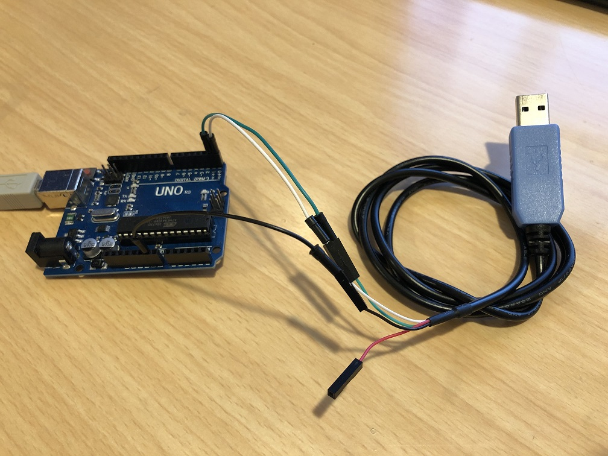
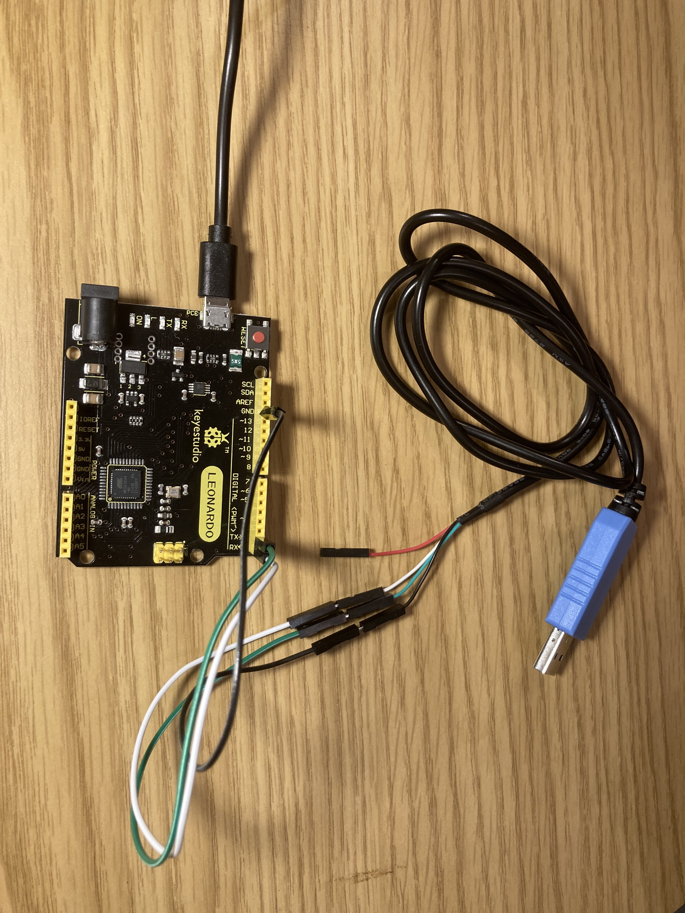
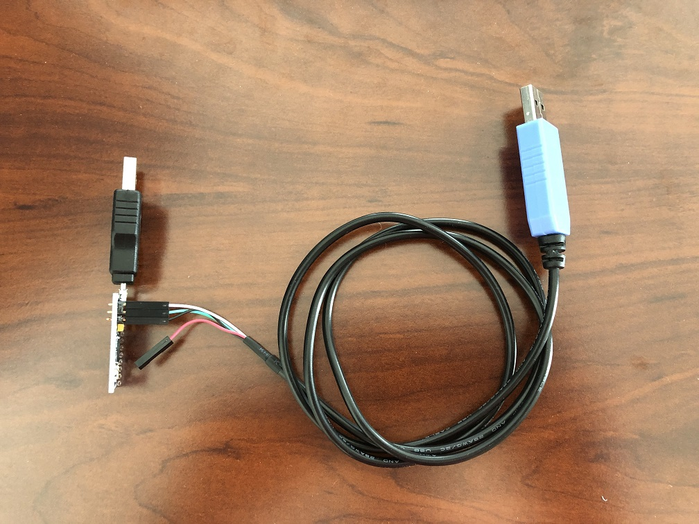
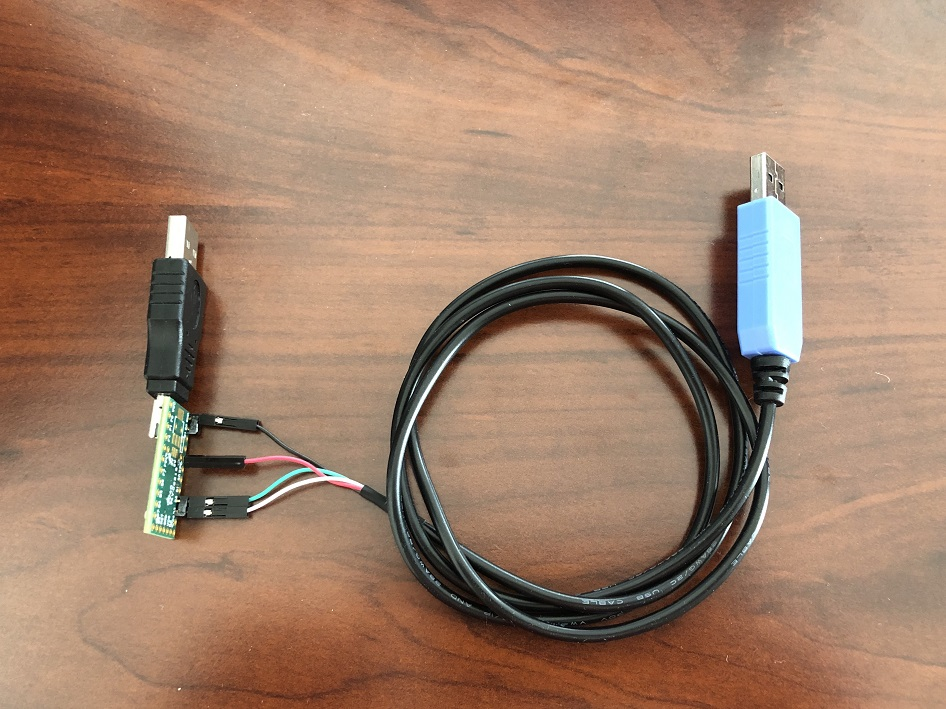
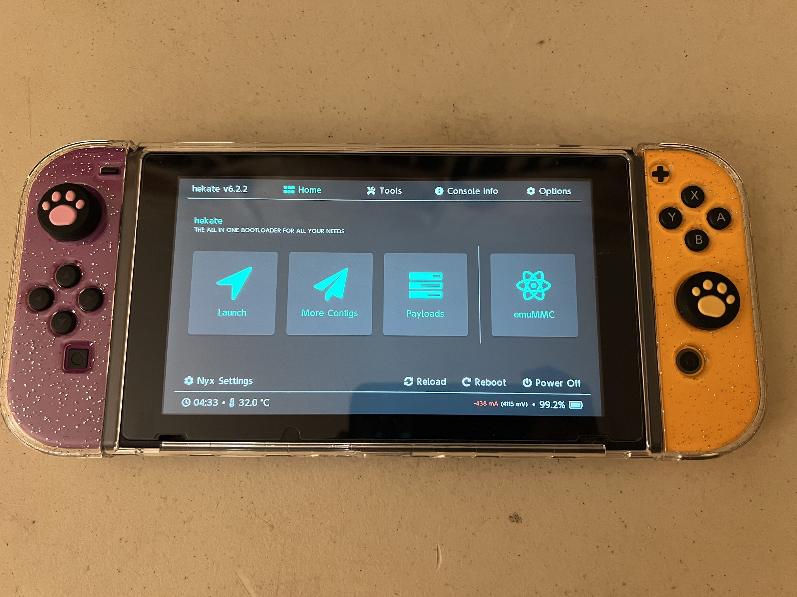
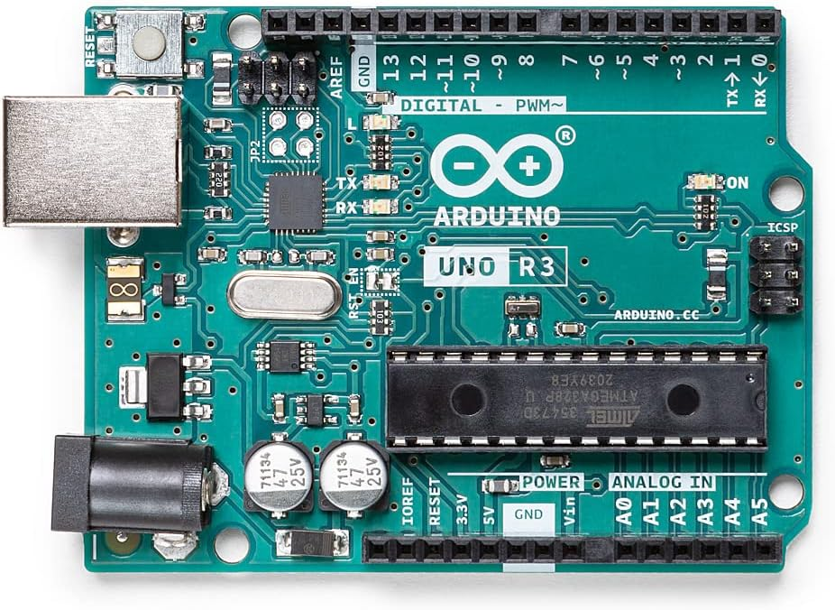
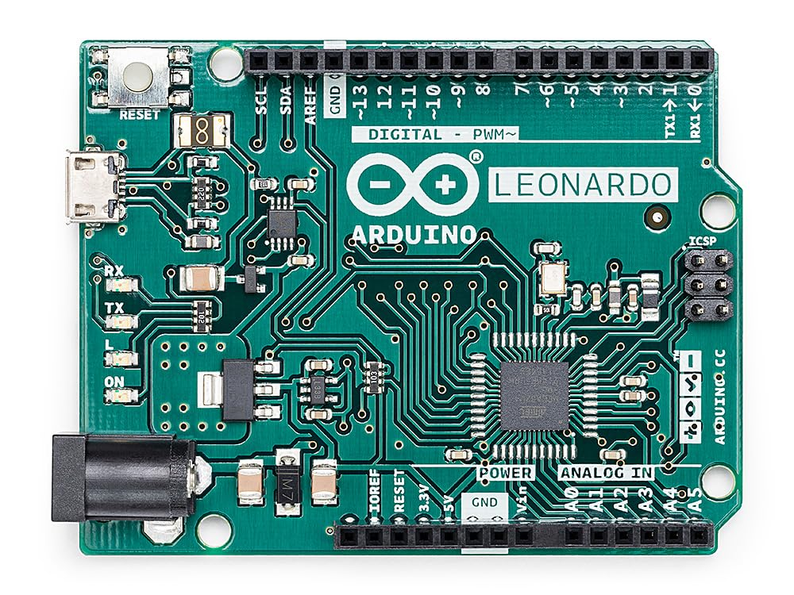
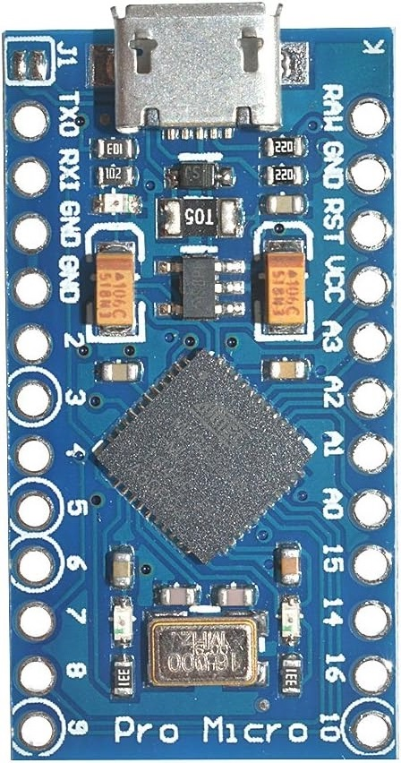
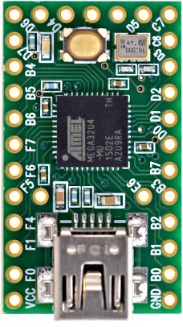
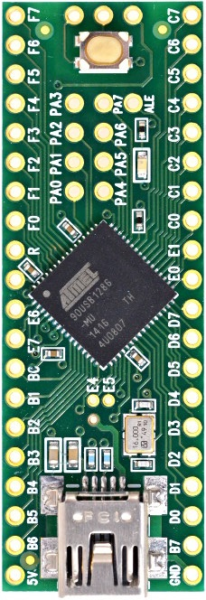

# Deprecated and Discontinued Controller List

This is a list of controllers which have been deprecated or discontinued. If you are setting up for the first time, please see the [supported controller list](ControllerList.md).

## Controller Setups

### Deprecated Setups:

These are older setups that are still supported, but will be removed in the future. Please do not use these setups.

| | **Device Type** | **Supported Controllers** | **Setup Difficulty (Scale 1-10)** | **Guides** |
| --- | --- | --- | --- | --- |
|  | Arduino Uno R3 {.nowrap} | NS2: Wired Controller (compatible with Switch 1) {.nowrap} | 6 | [Guide](SetupGuide/Controllers/Controller-ArduinoUnoR3.md) {.nowrap} |
|  | Arduino Leonardo {.nowrap} | NS2: Wired Controller (compatible with Switch 1) {.nowrap} | 6 | [Guide](SetupGuide/Controllers/Controller-ArduinoLeonardo.md) {.nowrap} |
|  | Pro Micro {.nowrap} | NS2: Wired Controller (compatible with Switch 1) {.nowrap} | 7 - (Mini Grabber) 9 - (Hammer Header) {.nowrap} | [Mini-Grabbers](SetupGuide/Controllers/Controller-ProMicro-MiniGrabbers.md) [Hammer Headers](SetupGuide/Controllers/Controller-ProMicro-HammerHeaders.md) {.nowrap} |
|  | Teensy 2.0 Teensy++ 2.0 {.nowrap} | NS2: Wired Controller (compatible with Switch 1) {.nowrap} | 7 - (Mini Grabber) 9 - (Hammer Header) {.nowrap} | [Mini-Grabbers](SetupGuide/Controllers/Controller-Teensy2-MiniGrabbers.md) [Hammer Headers](SetupGuide/Controllers/Controller-Teensy2-HammerHeaders.md) {.nowrap} |

### Discontinued Setups:

| | **Device Type** | **Supported Controllers** | **Recommended Replacement** |
| --- | --- | --- | --- |
|  | CFW: sys-botbase 2 {.nowrap} | NS1: Wired Controller {.nowrap} | CFW: sys-botbase 3 {.nowrap} |

### Setup Comparison Table:

| Setup | **Supported Controllers** | **Price (per Unit)** | **Setup Difficulty (Scale 1-10)** | **Notes:** |
| --- | --- | --- | --- | --- |
| Arduino Uno R3 {.nowrap} | NS2: Wired Controller {.nowrap} | Single: $20 {.nowrap} | 6 | [Vulnerable to power glitching.](PowerGlitching.md) {.nowrap} |
| Arduino Leonardo {.nowrap} | NS2: Wired Controller {.nowrap} | Single: $25 {.nowrap} | 6 | [Vulnerable to power glitching.](PowerGlitching.md) {.nowrap} |
| Teensy 2/Teensy++ 2 (Mini Grabbers) {.nowrap} | NS2: Wired Controller {.nowrap} | (discontinued) | 7 | [Vulnerable to power glitching.](PowerGlitching.md) Final product is bulky and fragile. {.nowrap} |
| Teensy 2/Teensy++ 2 (Hammer Headers) {.nowrap} | NS2: Wired Controller {.nowrap} | (discontinued) | 9 | [Vulnerable to power glitching.](PowerGlitching.md) {.nowrap} |
| Pro Micro (Mini Grabbers) {.nowrap} | NS2: Wired Controller {.nowrap} | Single: $25 Volume: $10 {.nowrap} | 7 | [Vulnerable to power glitching.](PowerGlitching.md) Final product is bulky and fragile. {.nowrap} |
| Pro Micro (Hammer Headers) {.nowrap} | NS2: Wired Controller {.nowrap} | Single: $25 Volume: $8 {.nowrap} | 9 | [Vulnerable to power glitching.](PowerGlitching.md) {.nowrap} |

## Device Types

| Image | Description |
| :---: | --- |
|  | **Arduino Uno R3**  Supported Controllers: - NS2: Wired controller  The Arduino Uno R3 is one of the original boards that spearheaded the Nintendo Switch automation community. However, its ATmega16U2 AVR8 CPU is very weak with only 512 bytes of ram and 12KB of usable program memory.  This controller is only suitable for emulating the basic wired controllers. It doesn't even have enough memory to hold multiple controller implementations the way that some of the newer controllers can. |
|  | **Arduino Leonardo**  Supported Controllers: - NS2: Wired controller  The Arduino Leonardo uses an ATmega32U4 AVR8 CPU. It has significantly more ram and program memory at 2.5KB and 32KB respectively. This was the last addition to the AVR8 microcontroller line up and was chosen because it was easier to setup a serial connection than the Teensy or Pro Micro boards.  Being an AVR8 processor, it shares codebase with the Arduino Uno R3 and thus we only support a single wired controller type on it. |
|  | **Pro Micro**  Supported Controllers: - NS2: Wired controller  The Pro Micro uses an ATmega32U4 AVR8 CPU and is functionally the same as the Arduino Leonardo and Teensy 2.0. This was added to our lineup because it was the cheapest microcontroller of this type in volume. Thus it became the work horse for many people with multiple Switches. |
|  | **Teensy 2.0**  Supported Controllers: - NS2: Wired controller  The Arduino Uno R3 is one of the original boards that spearheaded the Nintendo Switch automation community.  The Teensy 2.0 uses an ATmega32U4 AVR8 CPU and is functionally the same as the Arduino Leonardo and Pro Micro. This (along with the Teensy++ 2.0) was by far the best board during the microcontroller-only automation era due to the easy-to-use button to put the board into flash mode. It began to fall out of use in the computer-control era due to the difficulty of setting up a serial connection on it. |
|  | **Teensy++ 2.0**  Supported Controllers: - NS2: Wired controller  The Teensy++ 2.0 is the same as the Teensy 2.0, but with an upgraded AT90USB1286 CPU which has much more ram and program memory.  This extra ram and program memory was never put to use in this project. So it is functionally the same as the Teensy 2.0 along with all its advantages and drawbacks. |

**Discord Server:** 

