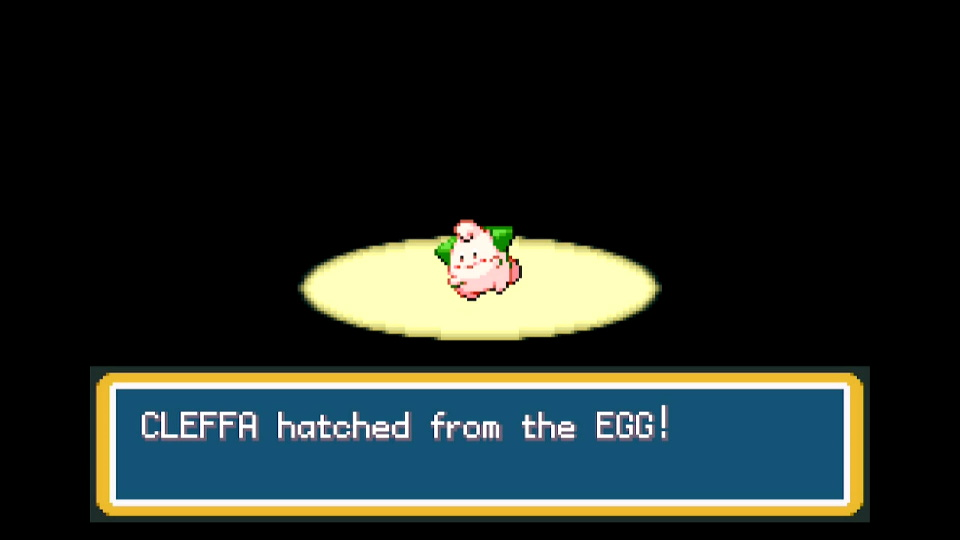
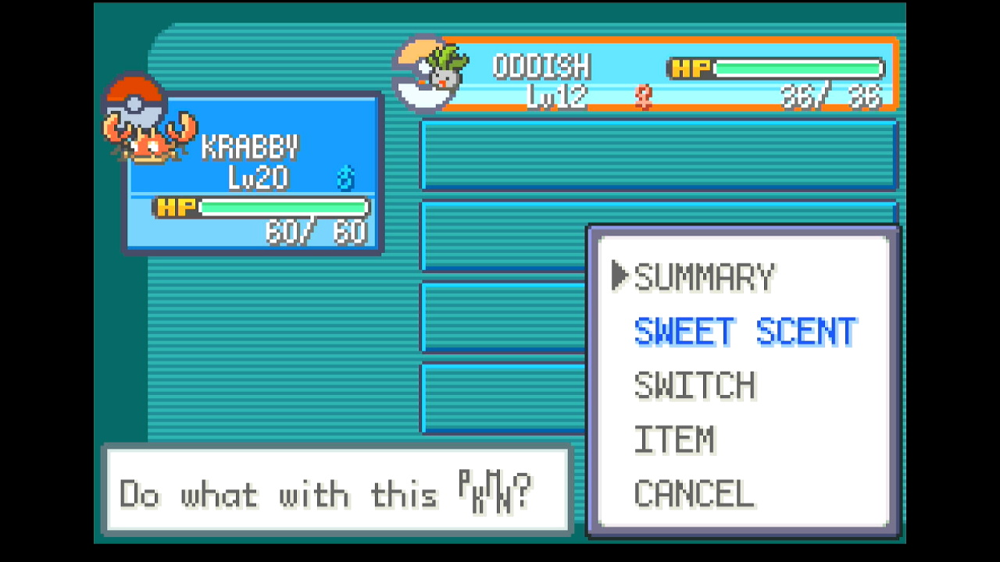
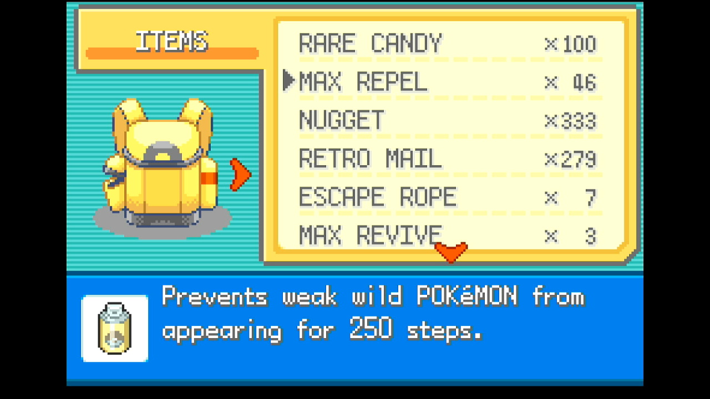
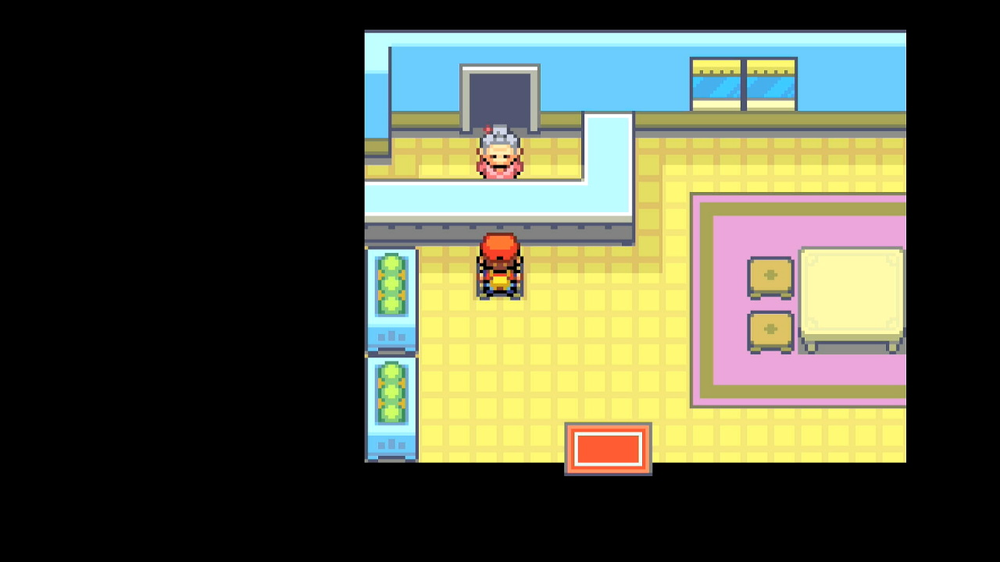
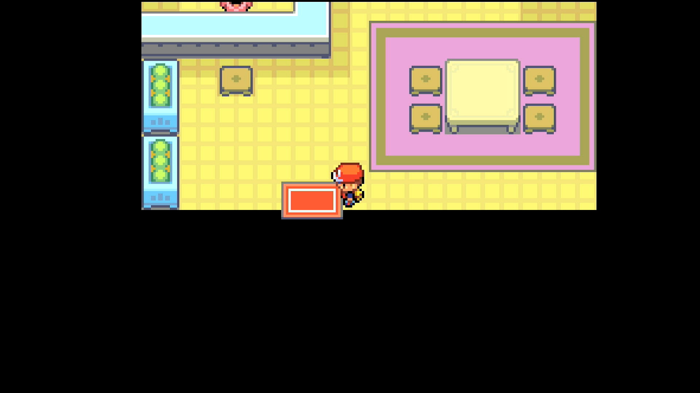
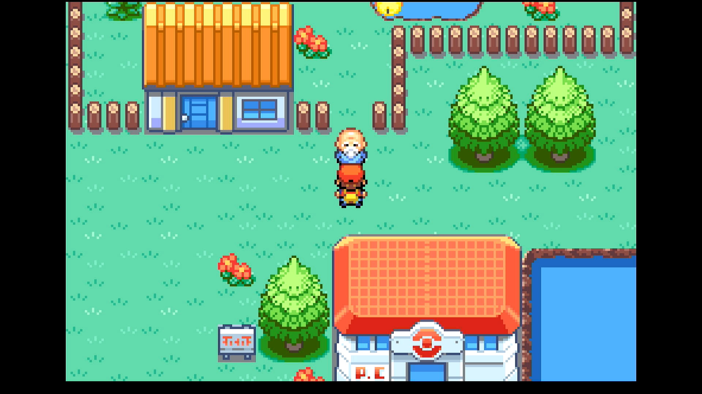

# Egg RNG (in development)

---
## Program Description

Fully automated button presses and calibration for performing RNG manipulation for day care eggs Pokémon in FireRed and LeafGreen. This program requires some knowledge of how RNG manipulation is performed as well as external tools to select your target frame and advance.

> **Disclaimer:** Egg RNG manipulation has historically not been recommended in FRLG due to the need to hit *two* frames correctly in order to obtain your intended Pokémon, which is easier in Emerald due to differences in how initial seeds work. For this reason, there are fewer tools available for assisting with finding desirable targets and performing manual calibration, and it requires more effort to select target frames.
>
> The following guides for egg RNG manipulation in FRLG cover the process of picking a target and performing manual calibrations:
> - [Percora's FRLG Shiny Egg Guide](https://docs.google.com/document/d/1ITVW3JuHAA7JCgG7mrCq-vZRtQj_Na8zm-98Z5voK3s)
> - [Refia's Egg RNG Abuse Guide](https://docs.google.com/document/d/1oqpZw0JsQGMDT6SjIEUOw7zcI9gpzfXd73UQNL4QrVQ)
>
> This program automates roughly the same steps outlined in Percora's guide.
>
> Because the Ten Lines tool does not support Egg RNG, [Pokefinder](https://github.com/Admiral-Fish/PokeFinder/releases) or the [FRLG Egg Search Tool](https://theastrogoth.github.io/frlg-egg-search/) can be used to select shiny egg frames.
>
> Due to the trickier calibration process and the time it takes to hatch eggs, this program will likely take significantly longer to run than other FRLG RNG programs.

---
## Instructions

**Switch Settings:**

1. Screen size: Must be 100% within the Switch settings
2. System memory: If the game data for FireRed/LeafGreen is on an SD card, move it to the Switch's system memory to reduce variability of reset times.
3. Single-Profile Users: If you only have one user profile, make sure you disable 'Skip Selection Screen' in System Settings -> User settings.
4. Disable Auto Sleep: Make sure to disable the 'Auto-Sleep' feature in System Settings -> Sleep Mode -> Auto-Sleep
5. [Switch 2: All HDR options must be disabled.](../NintendoSwitch/Switch2Notes.md#switch-2-hdr-may-be-problematic)
6. [Switch 2: The profile you are using must be the 1st (left-most) profile.](../NintendoSwitch/Switch2Notes.md#resetting-a-game-moves-the-cursor-to-the-1st-user-profile)

**Program Settings:**

1. Video Resolution: 1080p or higher

**Game Settings:**

1. Text Speed: Fast
2. Button Mode: **NOT L=A**
3. Frame: Type 1
4. Mono / Stereo depending on your target Seed

### Before You Start

- If you're not familiar with RNG manipulation in FireRed and LeafGreen, *don't start with this program*. First, read the [RNG Manipulation Guide](RngManipulationGuide.md) and try one of the other RNG programs first.

- Know your Secret ID and use it to determine your target Seed and Advance. See the [SID Helper](SidHelper.md) program for a way to obtain your Secret ID.

- Make sure you have Pokémon with the appropriate species, gender, and IVs to serve as the egg's parents.

### In-Game Instructions

- Unlock Four Island after defeating the Elite Four.
- Have at least three open slots in your party.
   - These are used for the egg and two wild Pokémon that are caught to confirm that you've hit the correct initial seed for the Held and Pickup frames.
- Have a Pokémon that knows Surf in your party.
    - Surf is used to encounter wild Pokémon in the nearby pond.
- Have a Pokémon that knows Sweet scent in the last occupied slot of your party.
 

- Register the BICYCLE to the SELECT button.
- If you have any Rare Candy, move it to the top of the bag's ITEMS pocket.
   - Using at least 10 Rare Candy is *strongly* recommended.
- Have at least 1 Max Repel in the 2nd-from-top spot of the bag.
 

- Place the balls you'd like to use during the RNG calibration at the top of the bag's POKé BALLS pocket
    - Using Master Balls is recommended if you have duplicated them via the Mail Glitch. See the [Item Duplication program](./ItemDuplication.md).
    - Any balls thrown during calibration will be *NOT* restored when the game is reset. 
- Drop off both parents at the Four Island Day Care. *Do not take any steps*.
> **Warning:** The order of the parents matters!

 

- Enter the necessary information about your target seed and RNG advance (see options below)
- Start the program

> **Warning:** This program will save the game in two places:
> 1) after taking 254 steps to prepare for held frame calibration
>  
> 2) after obtaining the correct held frame
>  
> 
> If the program is interrupted while running, you can continue the program from one of these save points. See the **Starting Point** option below. 
>
> There is a small chance that the program misses the held frame and saves the game in front of the Day Care Man. If this happens, it will fail to calibrate the pickup frame, and it will be necessary to manually complete the in-game setup from the beginning (Parent A can be left in the Day Care, but Parent B must be removed and re-deposited to reset the step counter).

---
## Displays

#### Target Details:

This shows the gender, nature, and IVs of your target based on the Target Settings entered below. Use this to check whether or not you've entered the correct target seed and advances.

#### Observed Stats:

This displays natures, genders, and calculated IV ranges observed from the most recently caught Pokémon as the program runs. 

Possible hits for seeds and advances are shown as well. If the program continually displays "No matches found", there may be a problem with the values for your program options (see the Options section below).

#### RNG Calibrations:

These will update automatically as the program runs. You can provide initial values for the **Seed Calibration**, **Continue Screen Frames Calibration**, and **In-Game Advances Calibration** before starting the program if you have previously performed calibrations, but it is not necessary to do so.

*If you're not sure, just leave these set to 0. The program will automatically make adjustments to hit the specified target.*

While calibrations for RNG advances can change depending on what you're hunting, seed calibrations should be consistent across hunts as long as your console and controller have not changed.

These values can be manually copied for use with the [RNG Helper](./RngHelper.md) if desired. 

---
## Options

### Game Information

#### Game Version:

FireRed or LeafGreen.

#### Game Language:

The language corresponding the version of the game you're playing. The Japanese version has different seeds than other languages.

#### Sound:

The in-game sound setting, either Mono or Stereo. This affects RNG seeds.

### Target Settings

#### Egg Species:

The Pokémon species to be bred, as determined by the parent species.

#### Parent Compatibility:

The compatibility of the parents as reported by the Day Care Man, which affects the probability that any frame will generate a held egg. 
- Parents of different species caught by the same trainer will have low ("don't seemt to like each other") compatibility. 
- Parents of the same species caught by the same trainer, or of different species caught by different trainers, will have medium ("seem to get along") compatibility. 
- Parents of the same species caught by different trainers will have high ("get along very well") compatibility.

#### Parent IVs:

The IVs of the parents. Parent A is the Pokémon dropped off first, and Parent B is the Pokémon dropped off second. The order matters, since it affects IV inheritance.

> **Warning:** This program requires knowing the exact values of the IVs of each parent. It will fail if incorrect IVs are provided.

### Held and Pickup Frame Settings

The following settings are required for both the Held and Pickup frames.

#### Target Seed:

The seed corresponding to your target. This should be a 4-character hex string (e.g. 70FE). Set this with the help of an external RNG tool

#### Advances:

The number of RNG advances to pass before triggering the encounter. Set this with the help of an external RNG tool.
This should be the *total* number of advances, *not* just the continue screen frames or in-game advances.

### Program Settings

#### Starting Point:

The point in the egg RNG manipulation process to start the program.
- Parents Dropped Off: before walking 254 steps (where the program is started following the setup instructions)
- Held Frame Calibration: after walking 254 steps and saving.
- Pickup Frame Calibration: after saving in front of the Day Care Man.

This option will be automatically update as the program runs, but can be manually changed as needed (e.g. if you forgot to save after hatching your shiny egg).

#### Nearby Seed Radius:

The number of seeds on each side of the target to consider when searching for hit frames. Larger values can lead to slower calibration.

#### Max Resets:

Set this to the maximum number of resets to attempt.

#### Max Balls Thrown:
The number of Pokéballs in your bag to attempt to throw. Make sure these are at the top position of the bag.
Balls thrown during calibration will *NOT* be restored after resetting.

#### Max Rare Candies:

The number of rare candies in your bag. Make sure these are at the top position of your ITEMS pocket.
Rare candies used during calibration will *NOT* be restored after resetting if the program hits the target frame.
If this value is set to 0 and your target gift has a low level, the program will likely take a *very long time* to perform calibrations. Using at least 10 Rare Candies is recommended. 

#### User Profile Position:

The position, from left to right, of the Switch profile with the FRLG save you'd like to use.
If this is set to 0, Switch 1 defaults to the last-used profile, while Switch 2 defaults to the first profile (position 1).
Only useful if using a Switch 2 and playing on a profile other than the primary one.

#### Take Video:

Record a video when a shiny is found.

#### Go Home when Done:

Go to the Switch Home to idle when finished.

---
## Credits

- **Author:** Astro (Tom)

**Discord Server:** 

