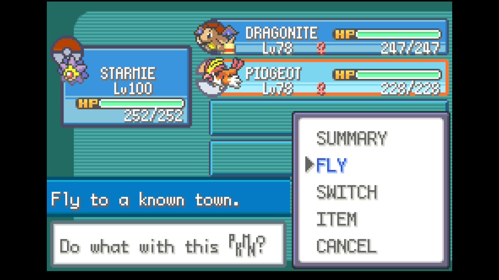
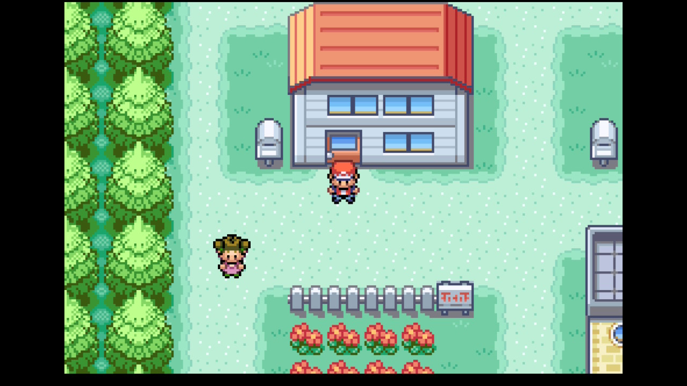

# Elite Four Farmer

## Program Description

Repeatedly defeat the rematch Elite Four and Champion with a single Pokémon that one-hit KOs every opponent. Winning the Pokémon League 200 times unlocks the Lorelei dolls and a trainer card star.

Each loop flies to Indigo Plateau, walks through all five rooms, and soft resets as soon as the Hall of Fame has saved. The save then loads outside your house in Pallet Town, ready for the next loop.

**This program is in beta.** It is listed under "Untested/Beta/WIP" in the FRLG programs list, which shows in beta builds.

## Instructions

**Switch Settings:**

1. Screen size: Must be 100% within the Switch settings
2. [Switch 2: All HDR options must be disabled.](../NintendoSwitch/Switch2Notes.md#switch-2-hdr-may-be-problematic)

**Program Settings:**

1. Video Resolution: 1080p or higher

**Game Settings:**

1. Text Speed: Fast
2. Battle Scene: Off
3. Battle Style: Set
4. Button Mode: **NOT L=A**
5. Frame: Type 1

**Other Setup:**

1. The Elite Four must have their **rematch teams**. They get these after you repair the Network Machine on One Island (after the Ruby and Sapphire quests in the Sevii Islands). The program's move choices are only correct for the rematch teams.
2. **Party slot 1:** the attacker. It must be:
    - Level 100, with 252 EVs in Sp. Atk and 252 EVs in Speed.
    - A nature that raises Sp. Atk.
    - At least the Sp. Atk and Speed below, as shown on the summary screen.
    - Holding the item listed below, if any.
    - Knowing exactly these moves, in this order (top-left, top-right, bottom-left, bottom-right):

    | Attacker | Moves (in order) | Held item | Sp. Atk | Speed |
    |---|---|---|---|---|
    | Starmie | Surf / Psychic / Ice Beam / Thunderbolt | Anything | 302+ | 190+ |
    | Mewtwo | Psychic / Ice Beam / Thunderbolt / Water Pulse | Mystic Water (optional) | 445+, or 405+ with Mystic Water | 190+ |
    | Lapras | Surf / Ice Beam / Psychic / Thunderbolt | NeverMeltIce | 277+ | 190+ |

    These numbers guarantee a one-hit KO on every opponent even with the lowest damage roll, and that the attacker always moves first. Each move has enough PP for a full run.
3. **Last party slot:** a Pokémon that knows Fly.
    - Fly needs to be the first move selectable from the POKéMON screen.
    - Indigo Plateau must be unlocked as a Fly destination.
4. (Optional) Other party members can hold an Exp. Share, **but only if they will not learn a new move or evolve** from the levels they gain. A move-learning prompt or an evolution will cause that run to fail and reset. A fully evolved Pokémon that has already learned all of its level-up moves is safe.
5. Save the game outdoors in Kanto, somewhere Fly can be used (for example, in Pallet Town). When the program recovers from an error, it soft resets and continues from this save.

### Instructions

1. Stand outdoors where you saved, with no menus open.
2. In the program, select your attacker and the starter you chose at the start of the game (this decides your rival's team).
3. Start the program.

## Options

### Attacker:

The Pokémon in party slot 1. Each attacker needs the exact moveset and stats from the table above.

### Your Starter:

The starter you picked at the start of the game. Your rival's team depends on it.

### Number of Wins:

Stop after this many League wins. The default is 200, the number needed for the Lorelei dolls. Zero runs until stopped.

### Go Home when Done:

Go to the Switch Home to idle when finished.

### Stop after Current Win:

While the program is running, press this to stop cleanly once the current League run has finished and reset.

## How It Works

- **Walking:** each walk is one continuous input timed to the game's frames. Running is not possible inside the Pokémon League.
- **Room checks:** after each door, the program checks the floor color to confirm it is in the expected Elite Four room. If the floor matches a different room instead (for example Bruno's yellow floor when it expected a blue one), it stops the run with an error. If the floor cannot be read, it logs the measured colors and continues.
- **Battles:** the opponents send out their Pokémon in a fixed order for each attacker, and the program uses the move that one-hit KOs each one.
- **Hall of Fame:** the program waits for "Saving... Don't turn off the power." to appear and disappear, then soft resets.
- **Errors:** after an error, the program soft resets and starts the loop again. It stops after 3 errors in a row.

## Credits

- **Author:** thewhitewolfking, with Claude (Anthropic)

**Discord Server:** 

