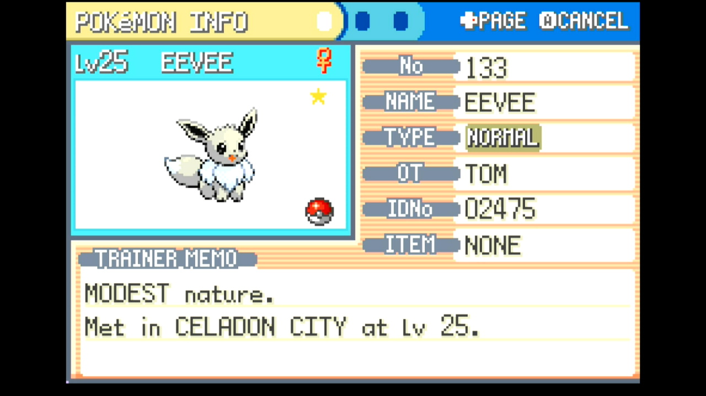
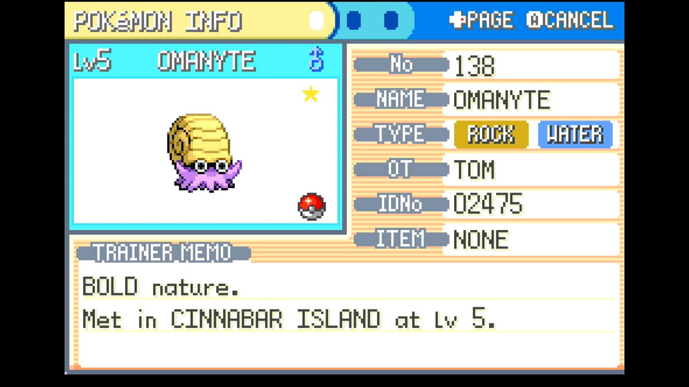
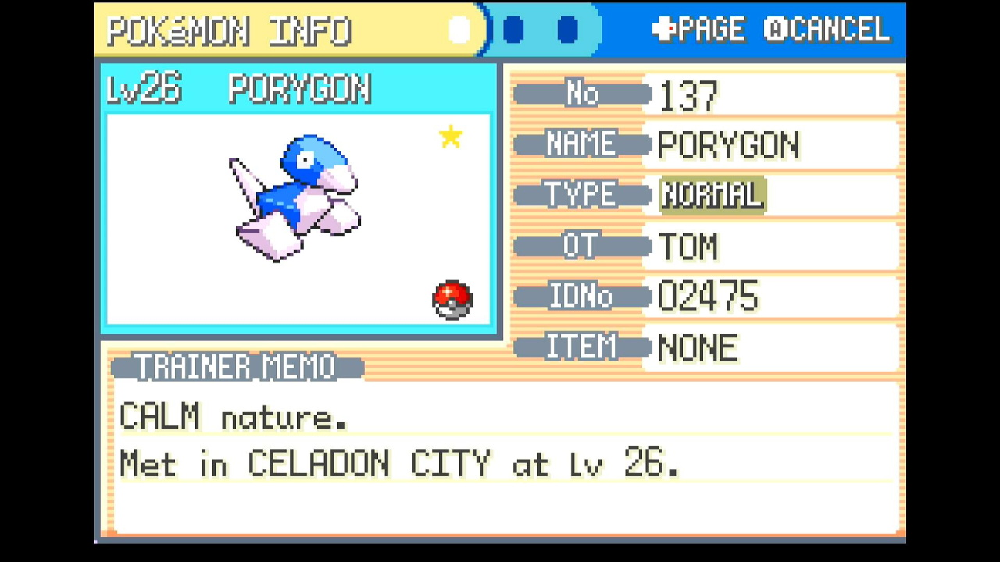
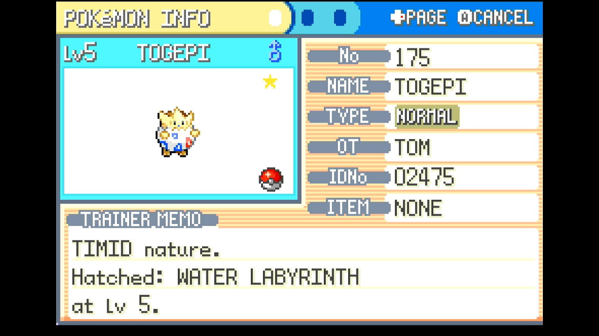

# Gift RNG (in development)

## Program Description

Fully automated button presses and calibration for performing RNG manipulation for gift Pokémon and Game Corner prizes in FireRed and LeafGreen. This program requires some knowledge of how RNG manipulation is performed as well as external tools to select your target frame and advance.


 
 

This program includes options for several RNG targets:

- Magikarp (Route 4 Gift)
- Hitmonchan / Hitmonlee (Saffron City Gift)
- Eevee (Celadon City Gift)
- Lapras (Silph Co. Gift)
- Omanyte / Kabuto / Aerodactyl (Fossils)
- Game Corner Prizes
   - Abra
   - Clefairy
   - Scyther / Pinsir
   - Dratini
   - Porygon
- Togepi (Water Labyrinth Gift Egg)

## Instructions

**Switch Settings:**

1. Screen size: Must be 100% within the Switch settings
2. [Switch 2: All HDR options must be disabled.](../NintendoSwitch/Switch2Notes.md#switch-2-hdr-may-be-problematic)
3. If the game data for FireRed/LeafGreen is on an SD card, move it to the Switch's system memory to reduce variability of reset times.

**Program Settings:**

1. Video Resolution: 1080p or higher

**Game Settings:**

1. Text Speed: Fast
2. Button Mode: **NOT L=A**
3. Frame: Type 1
4. Mono / Stereo depending on your target Seed

### Before You Start

- If you're not familiar with RNG manipulation in FireRed and LeafGreen, read the [RNG Manipulation Guide](RngManipulationGuide.md)

- Know your Secret ID and use it to determine your target Seed and Advance. See the [SID Helper](SidHelper.md) program for a way to obtain your Secret ID.

### Instructions

- Make sure you have a free spot in your party to allow the program to check the Pokémon you obtain.
- If you have any Rare Candy, move it to the top of the bag's ITEMS pocket.
- If using the Teachy TV, place it at the top of your KEY ITEMS pocket.
- In the game, navigate to the following locations:

| Target | Image |
| --- | --- |
| **Magikarp**<br>- Have at least 500 Pokédollars <br>- Save facing the Magikarp salesman | [](images//RngHelper-magikarp.jpg) |
| **Hitmonchan / Hitmonlee**<br>- Save facing the Pokéball with your desired choice | --- |
| **Eevee**<br>- Save facing Eevee's Pokéball | [](images//RngHelper-eevee.jpg) |
| **Lapras**<br>- Save facing the Silph Co. employee | [](images//RngHelper-lapras.jpg) |
| **Fossils**<br>- Give a fossil to the scientist at the Cinnabar Lab <br>- Exit and reenter the building <br>- Save next to the scientist | [](images//GiftReset1.png) |
| **Game Corner Prizes**<br>- Have enough coins to purchase your desired prize <br>- Save facing the prize counter | [](images//RngHelper-gamecorner.jpg) |
| **Togepi**<br>- Set your lead Pokémon to something with maximum Friendship <br>- Use your bicycle <br>- Save facing the old man | [](images//RngHelper-togepi.jpg) |

- Save the game
- Enter the necessary information about your target seed and RNG advance (see options below)
- Start the program

## Displays

### Observed Stats:

This displays natures, genders, and calculated IV ranges observed from the most recently received Pokémon as the program runs. 

Possible hits for seeds and advances are shown as well. If the program continually displays "No matches found", there may be a problem with the values for your program options (see the Options section below).

### RNG Calibrations:

These will update automatically as the program runs. You can provide initial values for the **Seed Calibration**, **Continue Screen Frames Calibration**, and **In-Game Advances Calibration** before starting the program if you have previously performed calibrations, but it is not necessary to do so.

*If you're not sure, just leave these set to 0. The program will automatically make adjustments to hit the specified target.*

While calibrations for RNG advances can change depending on what you're hunting, seed calibrations should be consistent across hunts as long as your console and controller have not changed.

These values can be manually copied for use with the [RNG Helper](./RngHelper.md) if desired. 

## Options

### Game Language:

The language corresponding the version of the game you're playing.

### Target:

The Pokémon to be received as a gift or prize. See the list of options at the top of this page.

### Max Resets:

Set this to the maximum number of resets to attempt.

### Max Rare Candies:

The number of rare candies in your bag. Make sure these are at the top position of your ITEMS pocket.
Rare candies used during calibration will be restored after resetting.
If this value is set to 0 and your target gift has a low level, the program may take noticeably longer to perform calibration. Miscalibrations may rarely occur due to the program's inability to narrow down the many possible RNG hits on every attempt.

### Target Seed:

The seed corresponding to your target. This should be a 4-character hex string (e.g. 70FE). Set this with the help of an external RNG tool

### Nearby Seeds:

A list of seeds, in order, containing the target seed, with one seed on each line. This list is used to calibrate the seed delay. Using at least ±5 seeds from your target is recommended.

Example, where ED7D is the target seed:
```
A3BD
E496
2C18
74BF
A58A
ED7D
3633
B454
DECA
2B6F
7499
```

### Seed Button:

The button to be pressed when setting the seed. Set this with the help of an external RNG tool.

### Extra Button:

Additional button presses during reset necessary to hit the target seed. Set this with the help of an external RNG tool.

### Seed Delay Time (ms):

The delay time corresponding to your target seed. Set this with the help of an external RNG tool. 
Because the program needs to wait for the entire title screen sequence to finish, 30473ms is the lowest supported seed delay.

### Advances:

The number of RNG advances to pass before receiving the gift. Set this with the help of an external RNG tool.
This should be the *total* number of advances, *not* just the continue screen frames or in-game advances.

### User Profile Position:

The position, from left to right, of the Switch profile with the FRLG save you'd like to use.
If this is set to 0, Switch 1 defaults to the last-used profile, while Switch 2 defaults to the first profile (position 1).
Only useful if using a Switch 2 and playing on a profile other than the primary one.

### Take Video:

Record a video when a shiny is found.

### Go Home when Done:

Go to the Switch Home to idle when finished.

## Credits

- **Author:** Astro (Tom)


<hr>

**Discord Server:** 


[](https://discord.gg/cQ4gWxN)