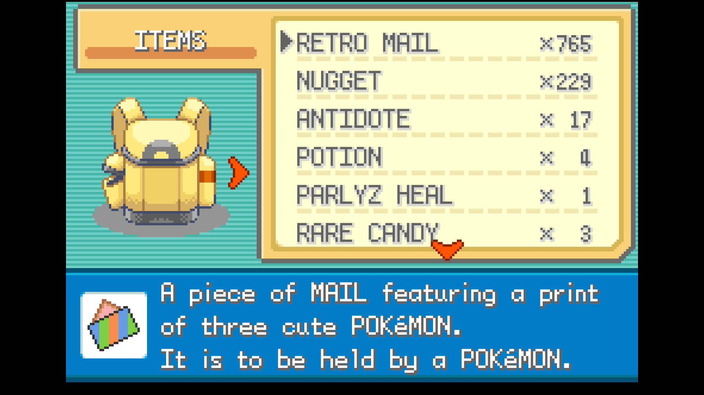
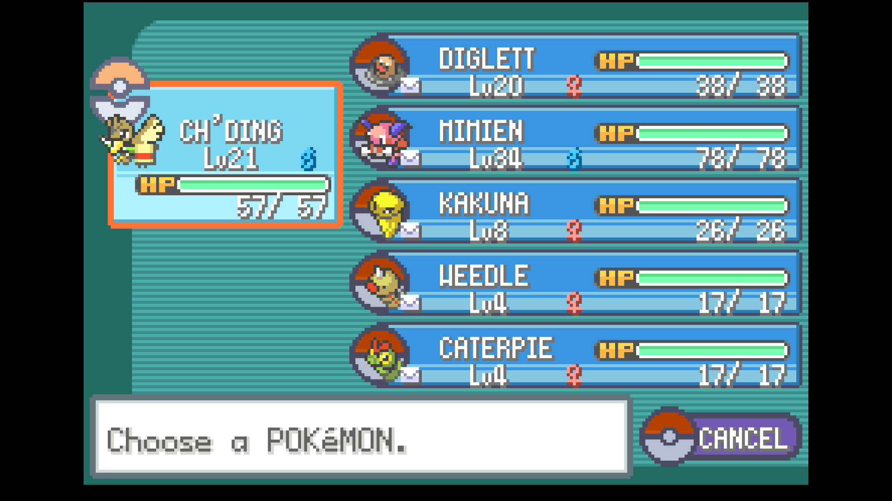

# Item Duplication (in development)

## Program Description

Repeatedly swap Retro Mail with the item Farfetch'd is holding to duplicate it. 

## Instructions

**Switch Settings:**

1. Screen size: Must be 100% within the Switch settings
2. [Switch 2: All HDR options must be disabled.](../NintendoSwitch/Switch2Notes.md#switch-2-hdr-may-be-problematic)

**Program Settings:**

1. Video Resolution: 1080p or higher

**Game Settings:**

1. Text Speed: Fast
2. Button Mode: **NOT L=A**
3. Frame: Type 1

**Other Setup:**

1. You have completed the [Retro Mail glitch](https://game8.co/games/Pokemon-FireRed-LeafGreen/archives/583965)

### Instructions

1. Farfetch'd is in the first party slot and holding the item you wish to duplicate.
2. The rest of your party is full and holding the correct Retro Mail for your glitch setup.
3. Retro Mail is the top slot of the bag page. (You can scroll down to it or move it to the top.)
4. Start the program with in the bag menu with the selection arrow on the Retro Mail.

## Options

### Number of Duplications:

Set this to the number of times you wish to duplicate an item. We currently do not check for running out of Mail so this should be set lower than the amount you have remaining.

### Go Home when Done:

Go to the Switch Home to idle when finished.

## Credits

- **Author:** dolphincurry/Dalton-V

**Discord Server:** 

