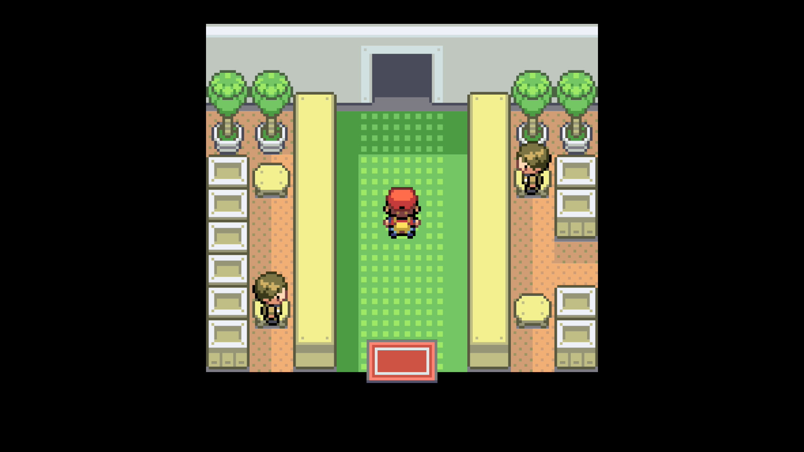
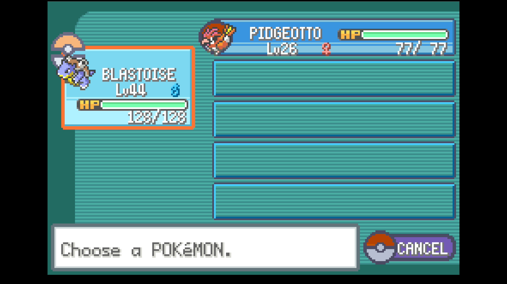

# Lucky Egg Farmer (in development)

## Program Description

Repeatedly attempt to catch Chansey and farm Lucky Eggs.

## Instructions

**Switch Settings:**

1. Screen size: Must be 100% within the Switch settings
2. [Switch 2: All HDR options must be disabled.](../NintendoSwitch/Switch2Notes.md#switch-2-hdr-may-be-problematic)

**Program Settings:**

1. Video Resolution: 1080p or higher

**Other Setup:**

1. Empty your party so that you only have 2 Pokemon:
    - Slot 1: A Pokemon level 34 or higher.
        - This prevents encounters while walking to the Chansey location.
    - Slot 2: A Pokemon exactly level 26.
        - We recommend Starmie or Staryu with the Illuminate ability for increased encounter rate.
2. Stand on the Pokeball icon in the Safari Zone building.
3. Use a Max Repel.
4. Save the game in this state so it can be quickly reset automatically.

## Credits

- **Author:** dolphincurry/Dalton-V

**Discord Server:** 

