# Getting Started with Automated RNG Manipulation

This is a brief introduction to the Pokémon Automation programs for automated RNG manipulation in FireRed and LeafGreen (FRLG). While the programs do most of the work for you, it's necessary to understand a little bit about how RNG manipulation works in order to set them up. 

> If you haven't used Pokémon Automation before, see the **[Getting Started Guide](https://pokemonautomation.github.io/SetupGuide/index.html)**.

---

## Table of Contents

1. [Programs and Other Resource](#programs-and-other-resources)
2. [Background and Terminology](#background-and-terminology)
3. [Finding your Secret ID](#finding-your-secret-id)
4. [Starter RNG Manipulation](#starter-rng-manipulation)

---

## Programs and Other Resources

Some of these will be referenced throughout this guide:

#### Pokémon Automation Programs
| Name | Description | 
| --- | --- |
| [SID Helper](./SidHelper.md) | A short program that helps with consistently setting your Secret ID (SID) when starting a new game. <br>It only takes a few seconds to run. |
| [Starter RNG](./StarterRng.md) | Automatic RNG manipulation of starter Pokémon. <br>This program doubles as a tool for confirming your SID. |
| [Gift RNG](./GiftRng.md) | Automatic RNG manipulation of gifts and other Pokémon that do not require being caught. |
| [Starter RNG](./StaticRng.md) | Automatic RNG manipulation of stationary encounters, such as Snorlax or Mewtwo. |
| [Wild RNG](./WildRng.md) | Automatic RNG manipulation of random wild Pokémon. |
| [RNG Helper](./RngHelper.md) | Semi-automated RNG manipulation of all types. <br>Requires manual calibration. |

#### Other Resources
| Name | Description |
| --- | --- |
| [Ten Lines](https://lincoln-lm.github.io/ten-lines/?page=1&game=fr_nx&targetInitialSeed=70FE&buttonMode=h&advancesMin=1000&advancesMax=5000) | An incredibly useful tool geared toward performing manual RNG manipulation. <br>We recommended it for picking out your RNG targets. |
| [RNG Manip Guide for Starters](https://www.youtube.com/watch?v=DfO2Zb9i3Bs) | A video guide by im a blisy that covers the basics of RNG manipulation in FRLG. |
| [Retail Pokémon RNG](https://retailrng.com/frlg/) | A website with guides geared toward performing RNG manipulation on retail game cartridges. <br>While most of the guides were written for Game Boy Advance rather than Switch, the general approach and most of the details remain the same. |
| [Smogon RNG Mechanics Guide](https://www.smogon.com/ingame/rng/pid_iv_creation) | A detailed explanation of how values from the RNG are used to generate Pokémon |

---

## Background and Terminology

To start with, let's define some terms and give enough context for them to make sense.

### The FRLG Random Number Generator

FireRed and LeafGreen use a [Linear Congruential Generator (LCG)](https://en.wikipedia.org/wiki/Linear_congruential_generator) for generating psuedo-random numbers, which are then used to determine all random values—including a Pokémon's gender, nature, ability, and IVs—that occur in the game. In particular, it uses the following formula for advancing its internal RNG:

``` Next Number = ( 0x41C64E6D * Previous Number + 0x6073 ) % 0x100000000 ```

What this means is that if we know how the RNG is initialized as well as how many RNG advances have passed before a Pokémon is generated, we can determine what its gender, nature, ability, and IVs will be. If you're interested in details about how values from the random number generator are used when a Pokémon is spawned, check out the  [Smogon RNG Mechanics Guide](https://www.smogon.com/ingame/rng/pid_iv_creation).

### Common Terms

<b>Seed:</b> the initialization of the RNG. The seed is set when a button is pressed on the title screen to progress the game to the continue screen. The value of the seed depends on the game version, the time passed since launching the game, the sound setting (Mono vs. Stereo), which button was pressed (A or Start), and whether any extra button presses occurred after launching the game. 

<b>Seed Delay:</b> the amount of time between launching the game and pressing a button on the title screen. Since the entire intro animation needs to play, the Seed Delay is always greater than 30 seconds.

<b>RNG Advances:</b> the number of times the RNG generates a new pseudo-random number after being initialized. These are often just referred to as "advances", and they occur at different rates in a few different situations:

- On the continue screen, they pass at rate of 1 RNG advance every frame (60 fps = 60 advances/s)
   + *These are often called Continue Screen Advances*
- After continuing the game, they pass at a rate of 2 RNG advances every frame (60 fps = 120 advances/s)
   + *These are often called In-Game Advances*
- If using the Teachy TV, they pass at a rate of 313 RNG advances every frame (60 fps = 18,780 advances/s)
- Movable boulders, breakable rocks, and NPCs can also cause extra RNG advances while not in a game menu.

<b>Trainer ID:</b> the ID number on a player's trainer card, as well as the OT ID number for their Pokémon. Often abbreviated as "TID".

<b>Secret ID:</b> a hidden value set when you start a new game. Together with the Trainer ID, it determines which Pokémon generated by the game are shiny. Often abbreviated as "SID".

---

## Finding your Secret ID

A player's Secret ID is not normally visible without using Arbitrary Code Execution, but knowing it is necessary for finding shinies via RNG manipulation. However, if precise button presses are used when starting a new game, an SID can be deduced from a TID.

In this guide, we'll use a new game, the SID Helper program, and the Starter RNG program to determine the Secret ID of the new save file. 

### Using the SID Helper program

Follow the instructions on the [SID Helper wiki page](./SidHelper.md). There is usually no reason to change the default value for the Target Advances, and 5 candidate SIDs is generally a good amount.

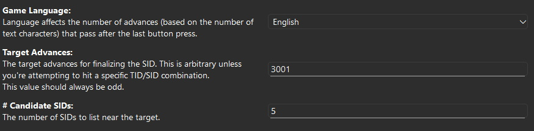

Once the program finishes, copy the results and save them somewhere (in a text file, on a piece of paper, etc.). While your SID is most likely the one associated with your target advances, it is possible that an adjacent SID was hit instead. 

In this example, after running the SID Helper, the Trainer ID was set to 48221, and the most-likely SID (at 3001 advances) was calculated to be 18705.

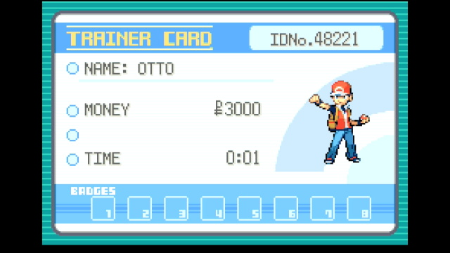

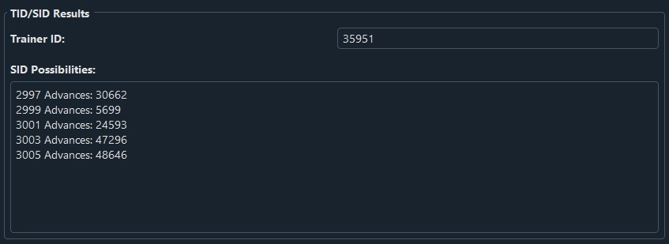

## Finding a target in Ten Lines

Now that we have a guess for the SID, we can try to use RNG manipulation to obtain a shiny starter. If we hit an RNG target that is expected to be shiny but isn't, we can rule out the SID we've tried and move onto one of the adjacent ones.

Before we begin the Starter RNG program, we need to pick out a shiny target with [Ten Lines](https://lincoln-lm.github.io/ten-lines/?page=1&game=fr_nx&targetInitialSeed=70FE&buttonMode=h&advancesMin=1000&advancesMax=5000). Navigate to the Calibration tab and enter the following information about your game:

- <b>Game:</b> either Switch FireRed or Switch LeafGreen. Each game will have different seeds
- <b>Sound:</b> either Mono or Stereo, whichever matches your in-game settings (Mono by default)
- <b>Button Mode:</b> Help. Make sure this is your in-game setting as well.
- <b>Seed Button:</b> A
- <b>Extra Button:</b> None
- <b>Console:</b> *Nintendo Switch 1*

> **IMPORTANT: Select Nintendo Switch 1 as your console in Ten Lines even if you're using a Switch 2**
> Otherwise, your seed timings will be off by 750ms and the Auto-RNG programs *will NOT work properly!*.

> **Avoid low seed delays when possible**
> Depending on your hardware, the FRLG RNG programs have a chance to fail when using seed delays close to 30,500ms. This happens when the button press on the title screen comes too early, throwing off all subsequent parts of the button press sequence. 
>
> If using a short seed delay, pay attention as the program opens the game and advances through the title screen. If you notice a problem or the program is unable to navigate to the encounter, either choose a new target with a higher seed delay or manually increase your seed calibration.

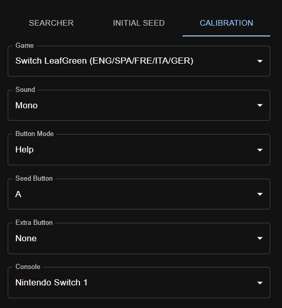

For checking the SID, we can prioritize a target with a low number of advances so that resets take less time. The following search settings are recommended for SID checking:

- <b>Target Seed:</b> whatever value is the default in Ten Lines (around 31300ms)
- <b>Seed +/-:</b> arbitrary. Make this larger if your search does not return any matching targets
- <b>Minimum Advances:</b> 1000
- <b>Maximum Advances:</b> 5000
- <b>Offset:</b> 0 (this can always be ignored)
- <b>Required Overworld Frames:</b> 600 (this can always be ignored)
- <b>Trainer ID:</b> your Trainer ID
- <b>Secret ID:</b> the candidate SID from the SID Helper

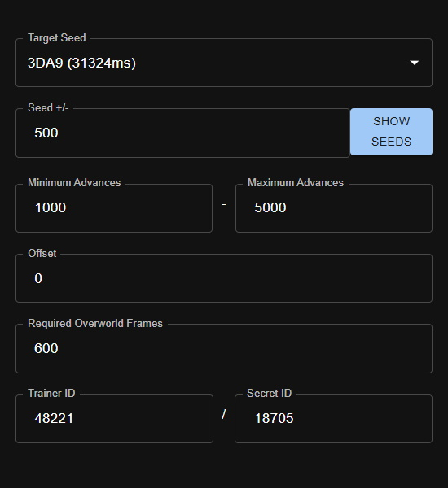

Finally, you can provide details about the Pokémon you'd like to find. For this step, we're not planning on keeping the starter we use to confirm our SID, so we won't specify any specific Nature, IVs, or gender:

- <b>Method:</b> Static 1 (all Gift and Stationary Pokémon always use the Static 1 method)
- <b>Category:</b> Starters
- <b>Pokémon:</b> whichever starter you'd like to obtain
- <b>Shininess:</b> Star/Square
- <b>Nature:</b> Any
- <b>Gender:</b> Any

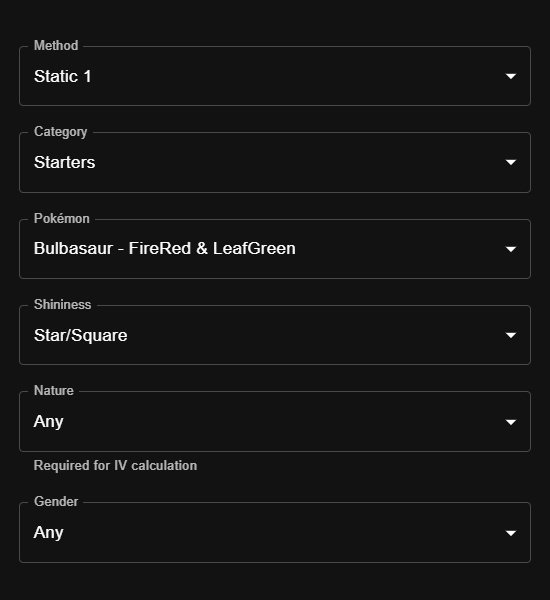

Once all of these inputs have been set, press the SUBMIT button near the bottom of the page to view the results of the search. We only need information from the first two columns, and any of the search results will work for testing an SID. 

Here is the target chosen for confirming the SID for our example:

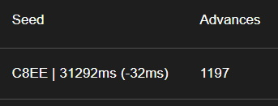

We need one more piece of information from Ten Lines before we move on: a list of seeds nearby our target. This can be obtained by setting the <b>Target Seed</b> to the one from our chosen search result, <b>Seed +/-</b> to a relatively small value (5 is recommended), and pressing the SHOW SEEDS button. Copy the seeds in the popup box to be pasted into the Starter RNG program's inputs.

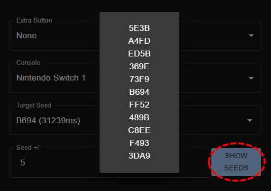

### Checking your SID with the Starter RNG program

Now that we have our target, we can enter its information into the [Starter RNG](./StarterRng.md), which will automatically perform calibrations to hit the specific seed/advance needed to generate the target Pokémon. Before moving on, follow the setup instructions for the program on its wiki page.

Ignore the Observed Stats and RNG Calibration sections for now and enter the information obtained from Ten Lines. Here are the settings for our example:

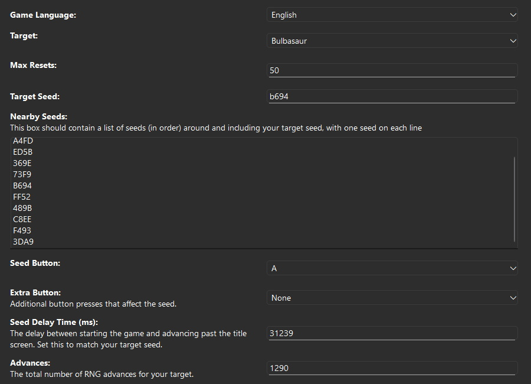

Once these have been entered, start the program. You can monitor its progress via the Observed Stats and RNG Calibration displays if you'd like. These update based on the Pokémon observed by the program on each reset. Here is what it looked like for our example after a few resets:

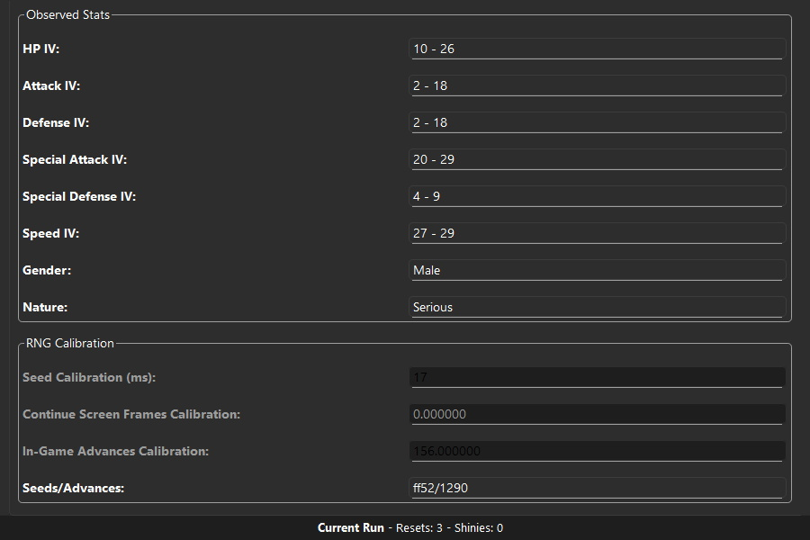

Note that the program hit FF52/1290 on its previous reset, which is already the correct number of RNG advances and only 1 seed away from the target.

On the next reset, it hit the target—a shiny—confirming that the SID is 18705. Record your confirmed SID somewhere safe, since you'll need it for any future RNG manipulation attempts with this save file.

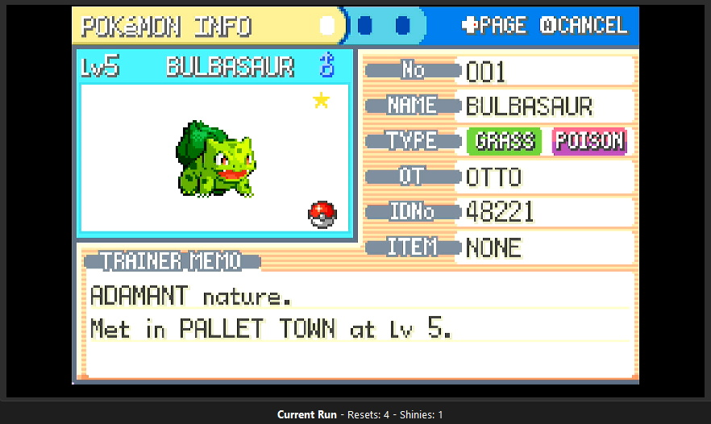

If the program instead ended on a non-shiny hit, another SID candidate from the list should be chosen (in our example, the SID from 2999 advances, 46295, would be the best choice). Then, enter this new SID into Ten Lines, repeat the search, choose a new target, and restart the Starter RNG program with the new target.

If the program has not finished after a large number of resets (30), check to make sure that it is making progress in its calibrations. If it frequently displays "No matches found" or fails to get closer to the target, double check the both your in-game settings and the settings you've entered for the program.

---

## Starter RNG Manipulation

Now that we know our SID for certain, we can safely dedicate time to hitting the shiny starter we'd like to keep. In the Ten Lines Calibration tab, add filters to specify what IVs, nature, and gender you'd like:

> **Note: The Searcher Tab on Ten Lines can also be used to search for a target with particular characteristics**

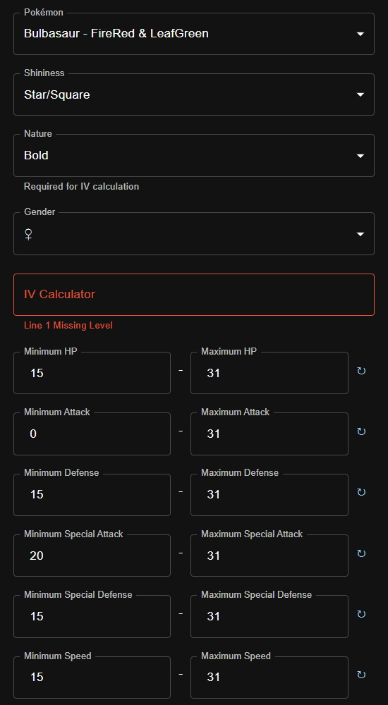

Since the more specific your filters are, the fewer hits the search will return, it may be helpful to expand the search range in Ten Lines by quite a bit. Note that each RNG advance takes roughly 8.33 milliseconds, so 50,000 advances corresponds to roughly 7 minutes of in-game time spent waiting.

> **Note: for any Pokémon other than the starters, the Teachy TV can be used to reach very large numbers of RNG advances quickly.**

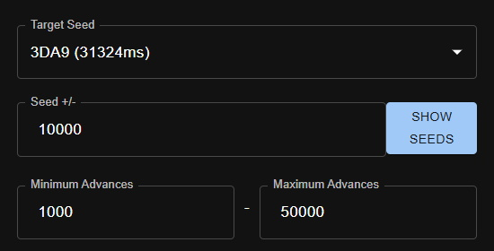

Once you've made these changes, resubmit the search and choose a target from the results. If you don't get any good results, you can change some of the options that affect possible seeds (Sound, Seed Button, and Extra Button) and try again.

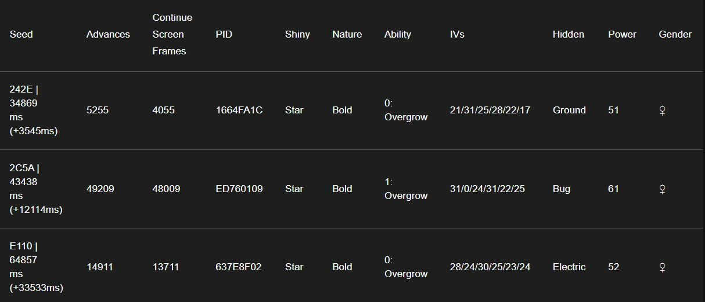

For this example, we'll go with the `61B4 | 54456ms, 6024` target. Enter the settings from your new target into the Starter RNG program...

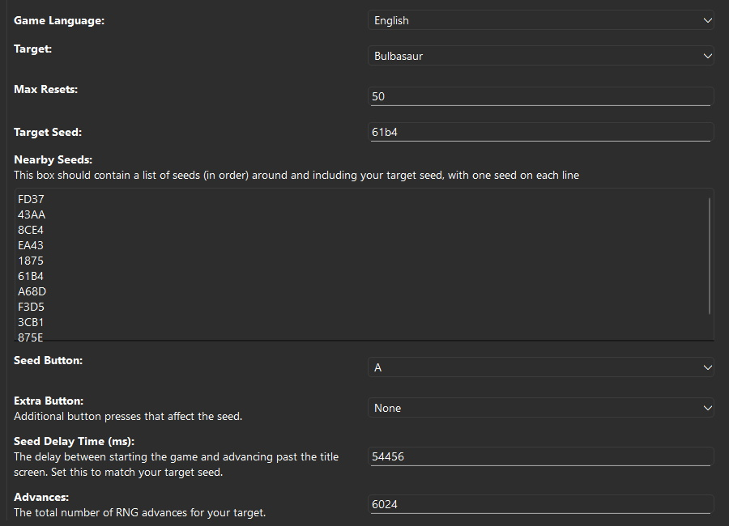

... and start it. Within a few resets, you should have your shiny starter! 

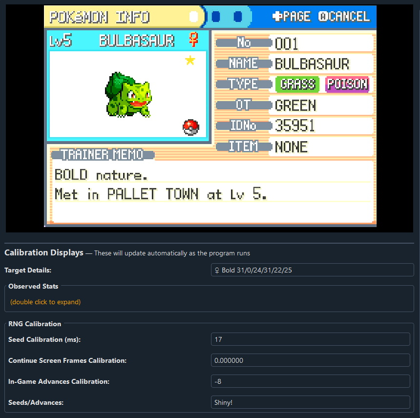


---

If you've followed along and obtained your shiny starter, congratulations! By this point, the hard part is over, and you should be familiar enough with Ten Lines and the RNG programs to use them to obtain nearly any Pokémon in FireRed or LeafGreen. Happy hunting!

---

## Credits

- **Documentation:** Astro (Tom), Butters
- **RNG Programs:** Astro (Tom)
