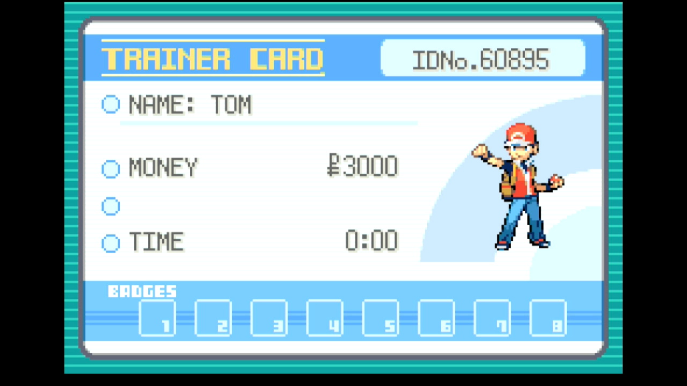
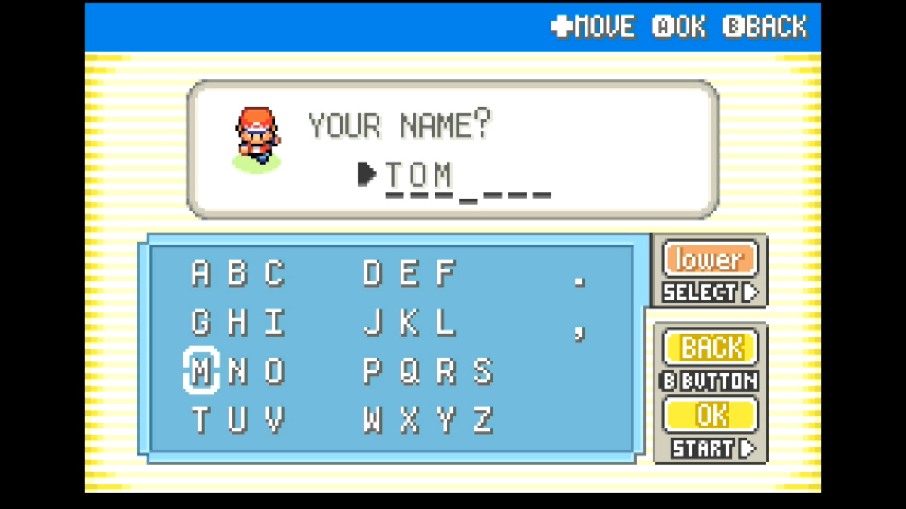

# SID Helper

## Program Description

A player's Secret ID (SID) is not normally visible without using Arbitrary Code Execution, but knowing it is necessary for finding shinies via RNG manipulation. However, if precise button presses are used when starting a new game, an SID can be deduced from a Trainer ID (TID).

This program automates button presses for hitting a particular frame when setting the player's TID and SID when starting a new game. Afterward, it calculates the possible SID values near the user-specified number of target advances. 

Note that this program always chooses the default name for your rival.

**Switch Settings:**

1. Screen size: Must be 100% within the Switch settings
2. [Switch 2: All HDR options must be disabled.](../NintendoSwitch/Switch2Notes.md#switch-2-hdr-may-be-problematic)
3. [Switch 2: The profile you are using must be the 1st (left-most) profile.](../NintendoSwitch/Switch2Notes.md#resetting-a-game-moves-the-cursor-to-the-1st-user-profile)

**Program Settings:**

1. Video Resolution: 1080p or higher

**Game Settings:**

1. Text Speed: Fast
2. Button Mode: **NOT L=A**
3. Frame: Type 1
4. Mono / Stereo depending on your target Seed

If you don't already have a save game, you will need to make a temporary save to establish your game settings before using this program.

### Instructions
- Start a new game and advance through the introduction to the point where you choose your in-game name
- Enter your desired name, but *DO NOT* press OK to confirm it

- Start the program
- After the program finishes, record the possible SIDs that appear for later use with RNG manipulation

## Options

### Game Language:

The language corresponding the version of the game you're playing. Although this program doesn't read any non-numeric text, the game language affects how many RNG advances pass during the introduction.

### Target Advances:

The number of RNG advances to wait before setting the SID. This is arbitrary unless you're trying to hit a specific TID/SID combination, which is beyond the scope of this program.
Due to the fact that two RNG advances pass every frame, this value should always be odd.

### # Candidate SIDs:

The number of SIDs to least near the specified Target Advances. These are only useful if the program misses your target.

### Go Home when Done:

Go to the Switch Home to idle when finished.

## Credits

- **Author:** Astro (Tom)

**Discord Server:** 

