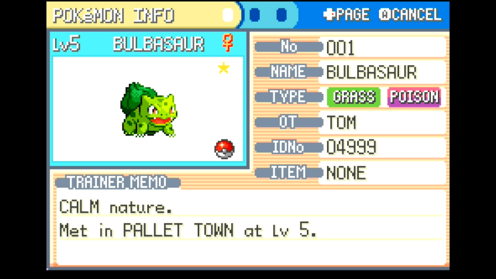
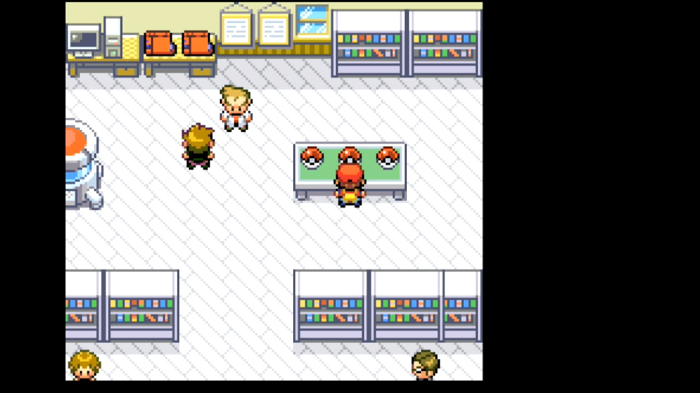

# Starter RNG

---
## Program Description

Fully automated button presses and calibration for performing RNG manipulation for a starter in FireRed and LeafGreen. This program requires some knowledge of how RNG manipulation is performed as well as external tools to select your target frame and advance.

---
## Instructions

**Switch Settings:**

1. Screen size: Must be 100% within the Switch settings
2. System memory: If the game data for FireRed/LeafGreen is on an SD card, move it to the Switch's system memory to reduce variability of reset times.
3. Single-Profile Users: If you only have one user profile, make sure you disable 'Skip Selection Screen' in System Settings -> User settings.
4. Disable Auto Sleep: Make sure to disable the 'Auto-Sleep' feature in System Settings -> Sleep Mode -> Auto-Sleep
5. [Switch 2: All HDR options must be disabled.](../NintendoSwitch/Switch2Notes.md#switch-2-hdr-may-be-problematic)
6. [Switch 2: The profile you are using must be the 1st (left-most) profile.](../NintendoSwitch/Switch2Notes.md#resetting-a-game-moves-the-cursor-to-the-1st-user-profile)

**Program Settings:**

1. Video Resolution: 1080p or higher

**Game Settings:**

1. Text Speed: Fast
2. Button Mode: **HELP**
3. Frame: Type 1
4. Mono / Stereo depending on your target Seed

### Before You Start

- If you're not familiar with RNG manipulation in FireRed and LeafGreen, read the [RNG Manipulation Guide](RngManipulationGuide.md)

- Know your Secret ID and use it to determine your target Seed and Advance. See the [SID Helper](SidHelper.md) program for a way to obtain your Secret ID.

### In-Game Instructions
- From the south side of the table, save facing the Pokéball with your desired starter

- Enter the necessary information about your target seed and RNG advance (see options below)
- Start the program

---
## Displays

#### Target Details:

This shows the gender, nature, and IVs of your target based on the Target Settings entered below. Use this to check whether or not you've entered the correct target seed and advances.

#### Observed Stats:

This displays natures, genders, and calculated IV ranges observed from the most recently received Pokémon as the program runs. 

Possible hits for seeds and advances are shown as well. If the program continually displays "No matches found", there may be a problem with the values for your program options (see the Options section below).

#### RNG Calibrations:

These will update automatically as the program runs. You can provide initial values for the **Seed Calibration**, **Continue Screen Frames Calibration**, and **In-Game Advances Calibration** before starting the program if you have previously performed calibrations, but it is not necessary to do so.

*If you're not sure, just leave these set to 0. The program will automatically make adjustments to hit the specified target.*

While calibrations for RNG advances can change depending on what you're hunting, seed calibrations should be consistent across hunts as long as your console and controller have not changed.

These values can be manually copied for use with the [RNG Helper](./RngHelper.md) if desired. 

---
## Options

### Game Information

#### Game Version:

FireRed or LeafGreen.

#### Game Language:

The language corresponding the version of the game you're playing. The Japanese version has different seeds than other languages.

#### Sound:

The in-game sound setting, either Mono or Stereo. This affects RNG seeds.

### Target Settings

#### Starter Species:

The starter of your choice (Bulbasuar, Squirtle, or Charmander).

#### Target Seed:

The seed corresponding to your target. This should be a 4-character hex string (e.g. 70FE). Set this with the help of an external RNG tool. 
The program automatically searches seed lists to determine the appropriate delay and buttons to press.

> **Avoid low seed delays when possible**
> Depending on your hardware, the FRLG RNG programs have a chance to fail when using seed delays close to 30,500ms. This happens when the button press on the title screen comes too early and fails to advance the game to the next screen, throwing off all subsequent parts of the button press sequence. 
>
> If using a short seed delay, pay attention as the program opens the game and advances through the title screen. If you notice a problem or the program is unable to navigate to the encounter, either choose a new target with a higher seed delay or manually increase your initial seed calibration.

#### Advances:

The number of RNG advances to pass before accepting the starter. Set this with the help of an external RNG tool.
This should be the *total* number of advances, *not* just the continue screen frames or in-game advances.

### Program Settings

#### Nearby Seed Radius:

The number of nearby seeds on each side of the target to search when identifying which seed was hit. It's usually a good idea to leave this at the default of 5, but it can be lowered once your seed calibration has settled. Larger values can lead to slower calibration.

#### Max Resets:

Set this to the maximum number of resets to attempt.

#### User Profile Position:

The position, from left to right, of the Switch profile with the FRLG save you'd like to use.
If this is set to 0, Switch 1 defaults to the last-used profile, while Switch 2 defaults to the first profile (position 1).
Only useful if using a Switch 2 and playing on a profile other than the primary one.

#### Take Video:

Record a video when a shiny is found.

#### Go Home when Done:

Go to the Switch Home to idle when finished.

---
## Credits

- **Author:** Astro (Tom)

**Discord Server:** 

