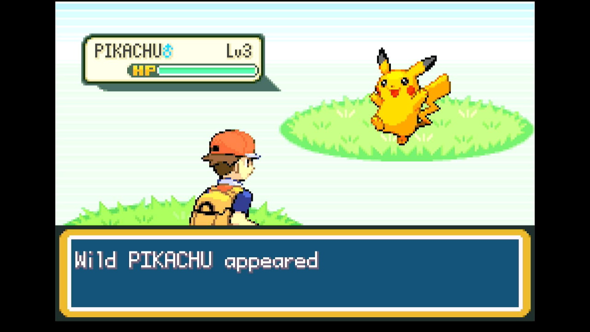
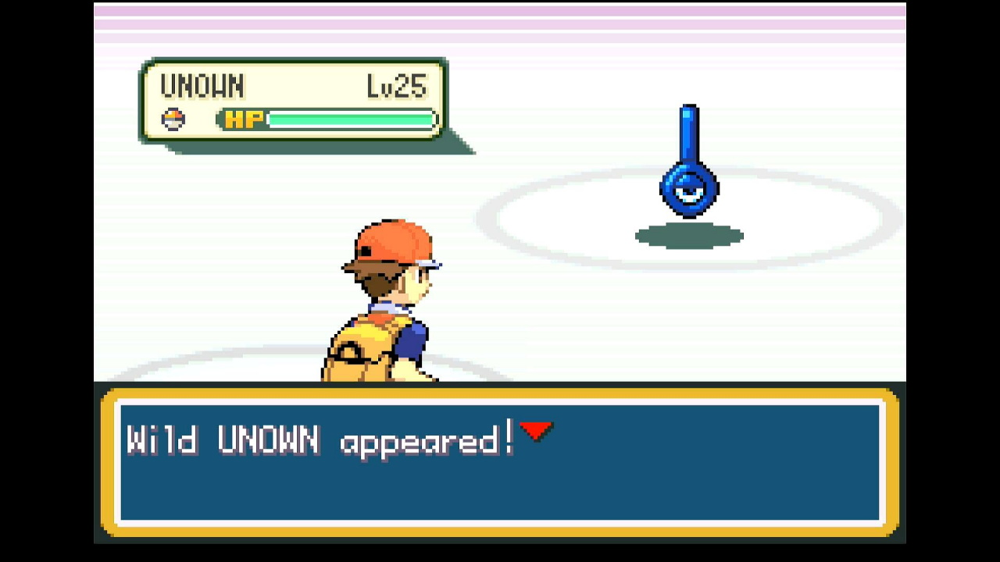
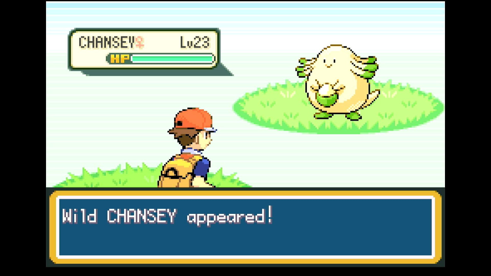
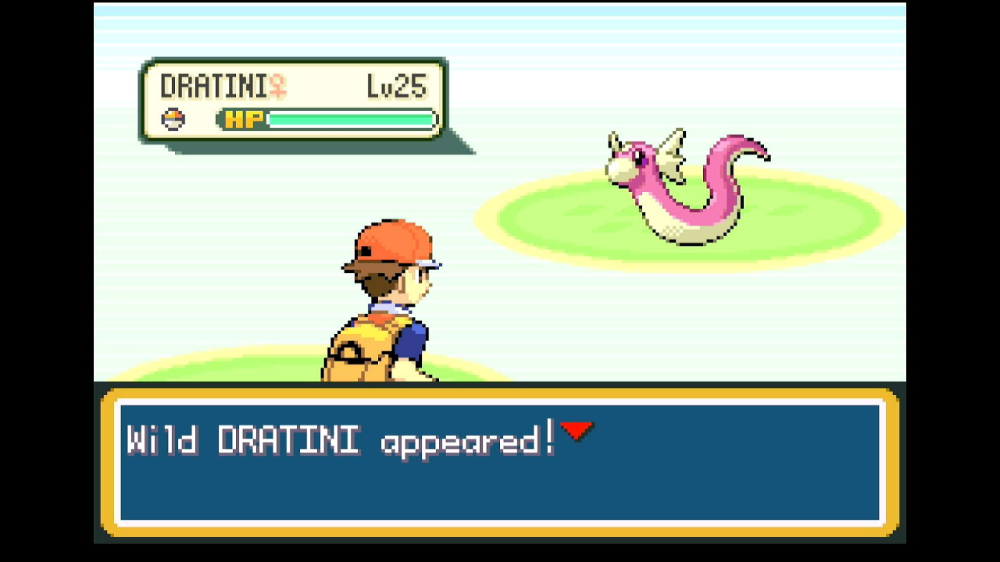

# Wild RNG (in development)

## Program Description

Fully automated button presses and calibration for performing RNG manipulation for random wild encounters in FireRed and LeafGreen. This program requires some knowledge of how RNG manipulation is performed as well as external tools to select your target frame and advance.

 
 

This program can be configured to obtain any Pokémon that can appear in random  (i.e. grass, surfing, fishing, or rock smash) encounters.

## Instructions

**Switch Settings:**

1. Screen size: Must be 100% within the Switch settings
2. System memory: If the game data for FireRed/LeafGreen is on an SD card, move it to the Switch's system memory to reduce variability of reset times.
3. Single-Profile Users: If you only have one user profile, make sure you disable 'Skip Selection Screen' in System Settings -> User settings.
4. Disable Auto Sleep: Make sure to disable the 'Auto-Sleep' feature in System Settings -> Sleep Mode -> Auto-Sleep
5. [Switch 2: All HDR options must be disabled.](../NintendoSwitch/Switch2Notes.md#switch-2-hdr-may-be-problematic)
6. [Switch 2: The profile you are using must be the 1st (left-most) profile.](../NintendoSwitch/Switch2Notes.md#resetting-a-game-moves-the-cursor-to-the-1st-user-profile)

**Program Settings:**

1. Video Resolution: 1080p or higher

**Game Settings:**

1. Text Speed: Fast
2. Button Mode: **NOT L=A**
3. Frame: Type 1
4. Mono / Stereo depending on your target Seed

### Before You Start

- If you're not familiar with RNG manipulation in FireRed and LeafGreen, read the [RNG Manipulation Guide](RngManipulationGuide.md)

- Know your Secret ID and use it to determine your target Seed and Advance. See the [SID Helper](SidHelper.md) program for a way to obtain your Secret ID.

- Make sure you have have any items/moves/abilities that you need to facilitate catching your target.

### Instructions

- Make sure you have a free spot in your party to allow the program to check the Pokémon you catch.
- Place the balls you'd like to use during the RNG calibration at the top of the bag's POKé BALLS pocket
    - Using a Master Ball is recommended.
    - Any balls thrown during calibration will be restored when the game is reset. 
    - If hunting a non-shiny target, this is the ball your target will be caught in.
- If you have any Rare Candy, move it to the top of the bag's ITEMS pocket.
- If using the Teachy TV, place it at the top of your KEY ITEMS pocket.

**For Grass or Surfing encounters:**

- Have a Pokémon that knows Sweet Scent in the last slot of your party
- Move to a tile that can spawn the Pokémon you're trying to obtain
- Save the game
- Enter the necessary information about your target seed and RNG advance (see options below)
- Start the program

**For Fishing encounters**

- Register the relevant fishing rod to the SELECT button.
- Move adjacent to a water tile that can spawn the Pokémon you'd like, facing it
- Save the game
- Enter the necessary information about your target seed and RNG advance (see options below)
- Start the program

**For Rock Smash encounters**

- Have a Pokémon that knows Rock Smash in your party
- Move adjacent to a breakable rock, facing it
- Save the game
- Enter the necessary information about your target seed and RNG advance (see options below)
- Start the program

**Safari Zone**
- If you haven't ever entered the Safari Zone in your current save, enter and exit the Safari Zone
- If fishing, register the rod you'd like to use to the SELECT button 
- Have at least 500 Pokédollars 
- Stand atop the Pokéball logo on the floor of the Safari Zone entrance 
- If not fishing, use a Max Repel 
- Save the game 
- Enter the necessary information about your target seed and RNG advance (see options below)
- Start the program


## Displays

### Observed Stats:

This displays natures, genders, and calculated IV ranges observed from the most recently caught Pokémon as the program runs. 

Possible hits for seeds and advances are shown as well. If the program continually displays "No matches found", there may be a problem with the values for your program options (see the Options section below).

### RNG Calibrations:

These will update automatically as the program runs. You can provide initial values for the **Seed Calibration**, **Continue Screen Frames Calibration**, and **In-Game Advances Calibration** before starting the program if you have previously performed calibrations, but it is not necessary to do so.

*If you're not sure, just leave these set to 0. The program will automatically make adjustments to hit the specified target.*

While calibrations for RNG advances can change depending on what you're hunting, seed calibrations should be consistent across hunts as long as your console and controller have not changed.

These values can be manually copied for use with the [RNG Helper](./RngHelper.md) if desired. 

## Options

### Game Language:

The language corresponding the version of the game you're playing.

### Game Version:

Set this to the version of the game you're playing — FireRed or LeafGreen.

### Encounter Type:

The type of wild encounter. "Grass" refers to any land-based random encounter. The other options are self-explanatory.

### Location:

The in-game location of the wild encounter. Not all encounter types are compatible with all locations (since not every location has water, breakable rocks, etc.)

### Max Resets:

Set this to the maximum number of resets to attempt.

### Max Balls Thrown:
The number of Pokéballs in your bag to attempt to throw. Make sure these are at the top position of the bag.
Balls thrown during calibration will be restored after resetting.

### Max Rare Candies:

The number of rare candies in your bag. Make sure these are at the top position of your ITEMS pocket.
Rare candies used during calibration will be restored after resetting.
If this value is set to 0 and your target gift has a low level, the program may take noticeably longer to perform calibration. Miscalibrations may rarely occur due to the program's inability to narrow down the many possible RNG hits on every attempt.

### Target Seed:

The seed corresponding to your target. This should be a 4-character hex string (e.g. 70FE). Set this with the help of an external RNG tool

### Nearby Seeds:

A list of seeds, in order, containing the target seed, with one seed on each line. This list is used to calibrate the seed delay. Using at least ±5 seeds from your target is recommended.

Example, where ED7D is the target seed:
```
A3BD
E496
2C18
74BF
A58A
ED7D
3633
B454
DECA
2B6F
7499
```

### Seed Button:

The button to be pressed when setting the seed. Set this with the help of an external RNG tool.

### Extra Button:

Additional button presses during reset necessary to hit the target seed. Set this with the help of an external RNG tool.

### Seed Delay Time (ms):

The delay time corresponding to your target seed. Set this with the help of an external RNG tool. 
Because the program needs to wait for the entire title screen sequence to finish, 30473ms is the lowest supported seed delay.

> **Avoid low seed delays when possible**
> Depending on your hardware, the FRLG RNG programs have a chance to fail when using seed delays close to 30,500ms. This happens when the button press on the title screen comes too early and fails to advance the game to the next screen, throwing off all subsequent parts of the button press sequence. 
>
> If using a short seed delay, pay attention as the program opens the game and advances through the title screen. If you notice a problem or the program is unable to navigate to the encounter, either choose a new target with a higher seed delay or manually increase your initial seed calibration.

### Advances:

The number of RNG advances to pass before triggering the encounter. Set this with the help of an external RNG tool.
This should be the *total* number of advances, *not* just the continue screen frames or in-game advances.

### User Profile Position:

The position, from left to right, of the Switch profile with the FRLG save you'd like to use.
If this is set to 0, Switch 1 defaults to the last-used profile, while Switch 2 defaults to the first profile (position 1).
Only useful if using a Switch 2 and playing on a profile other than the primary one.

### Take Video:

Record a video when a shiny is found.

### Go Home when Done:

Go to the Switch Home to idle when finished.

## Credits

- **Author:** Astro (Tom)


<hr>

**Discord Server:** 


[](https://discord.gg/cQ4gWxN)