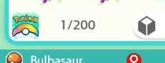

<!-- Name Of Program (Populates Nav Bar) -->
# Box Sorter - Living Dex (In Development)

## Program Description

This is a variant of the Box Sorter program that is designed to be used for sorting a Living Dex. When sorting a living dex, the goal is to keep a single copy of each Pokemon. This means there will be two sections of boxes being edited. A "Living Dex" section that contains one copy of each Pokemon, and a "Reject Box" section that contains the duplicates. This also means that the living dex may have multiple empty slots where a specific Pokemon is missing. For example, if you only have Male Venusaur, then there will be an empty slot where the Female Venusaur would be in the living dex. 

## Instructions

**Switch Settings:**

1. Screen size: Must be 100% within the Switch settings
2. [Switch 2: All HDR options must be disabled.](../NintendoSwitch/Switch2Notes.md#switch-2-hdr-may-be-problematic)

**Program Settings:**

1. Video Resolution: 1080p or higher

**Other Setup:**

1. Start the program in the first box of the "Living Dex" or "Reject Box" section, depending on which section comes first in your box layout.

## Options

**Living Dex Starting Box:**
This is the starting box of the "Living Dex" section. You can see it by navigating to your desired starting box and looking at the box number in the bottom left of the screen.

**Reject Box Range Start:**
This is the starting box of the "Reject Box" section. You can see it by navigating to your desired starting box and looking at the box number in the bottom left of the screen.

**Reject Box Range End:**
This is the ending box of the "Reject Box" section. You can see it by navigating to your desired ending box and looking at the box number in the bottom left of the screen.

Box Number Input:

**Living Dex Style:**

These are the current supported layouts for sorting a Living Dex. See the [Living Dex Styles](#living-dex-styles) section below for more details on the different layouts.

**Shiny Dex:**

If enabled, the program will only keep shiny Pokemon in the "Living Dex" section, and all non-shiny Pokemon will be moved to the "Reject Box" section. If disabled, all Shiny Pokemon will be moved to the "Reject Box" section.

**OT Name Language:**

If you want your Living Dex to all have your Trainer Name select the language of your Trainer Name here. If you don't care about OT Name leave this set to "None".

**OT Name Filter:**

This will show up if the OT Name Language is set to something other than "None". This is where you set your Trainer Name. If a language is selected any Pokemon without your Trainer Name will be moved to the "Reject Box" section.

**Capture Card Delay:**

This is a carryover option from the Box Sorter program and will probably be removed in future updates. We suggest testing your capture card delay with the original Box Sorter program and then using that same delay for this program.

**Pokémon Home App Delay:**

This is a carryover option from the Box Sorter program and will probably be removed in future updates. We suggest testing your Pokémon Home App delay with the original Box Sorter program and then using that same delay for this program.

**Output File:**

The program saves the catalogued Pokémon summary information into `<output_file>.json` and its planned sorted Pokémon order into `<output_file>-sorted.json`.

**Dry Run:**

If checked, the program will only catalogue Pokémon summary information into `<output_file>.json` and `<output_file>-sorted.json` without sorting the Pokémon in Home.
This is useful for exporting your Pokémon Home data.

### Living Dex Styles

**Sorted by Forms: (50 Boxes Required)**

Pokémon Boxes are sorted following HOME's National Dex order, mixing Species and Forms together.
Example: Bulbasaur, Ivysaur, Venusaur, Venusaur (Female), Venusaur (Gigantamax), Charmander, Charmeleon, Charizard, Charizard (Gigantamax), etc.

**Sorted by Species: (50 Boxes Required)**

Pokémon Boxes are sorted following HOME's National Dex order, separating Species and Forms. First you will find all the species, then all the forms.
Example: Bulbasaur, Ivysaur, Venusaur, Charmander, Charmeleon, Charizard, .... terapagos, pecharunt, Venusaur (Female), Venusaur (Gigantamax), Charizard (Gigantamax), etc.

More layout are planned to be added in the future, if we are missing a layout you would like to see, please let us know in the discord server!

### Known Limitations

- The current dex layouts do not include "shiny locked" Pokemon. So there may be an empty slot in the living dex for a pokemon that does not have a shiny form. This is something we are planning on addressing in a future update.

- Some forms are missing correct detection. These are forms where the difference is usually a small change in color or object. Examples include Cap Pikachu, Alcremie, Unown, Vivillon and more. We are planning on improving form detection in a future update, for now these slots will be filled with any normal form of that pokemon.

- Missing calculation for checking if there are enough empty slots in the reject box section to fit all the duplicates. If there are not enough empty slots, the program will attempt to place the duplicates in currently unsorted living dex spaces with the hope that some of the rejects will be used in later living dex slots. If it runs out of space in the reject box section and the end of the living dex, the program will stop. We are planning on adding a check for this in a future update. In the meantime, if you are worried about having enough space you may want to run the standard Box Sorter program first to condense your boxes before running this program.

## Credits

- **Author:** dolphincurry/Dalton-V

**Discord Server:** 

