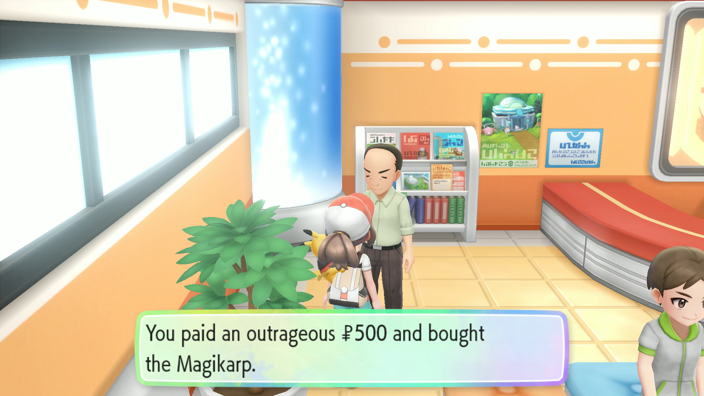

# Gift Reset

## Program Description

Shiny hunt gift Pokemon by resetting the game.

For fossils, use [Fossil Revival](FossilRevival.md) instead.

## Settings

**Switch Settings:**

1. Screen size: Must be 100% within the Switch settings
2. [Switch 2: All HDR options must be disabled.](../NintendoSwitch/Switch2Notes.md#switch-2-hdr-may-be-problematic)
3. [Switch 2: The profile you are using must be the 1st (left-most) profile.](../NintendoSwitch/Switch2Notes.md#resetting-a-game-moves-the-cursor-to-the-1st-user-profile)

**Program Settings:**

1. Video Resolution: 1080p or higher

**Game Settings:**

1. Text Speed: Fast
2. Make sure the system date on your Switch is later than the catch date of any Pokemon you have. The program sorts the box by Recently Caught to navigate to the correct Pokemon and shiny check. (This mostly an issue if you've caught Pokemon in the "future" from date-skipping.)

## Instructions

1. Stand in front of the gift NPC. (Locations [here](https://www.serebii.net/letsgopikachueevee/gift.shtml).)

    - For Magikarp, make sure you have the money to purchase it.
    - For any gifts with a catch requirement, make sure you've fulfilled it.

2. Save the game.
3. Start the program in-game.

## Options

### Go Home when Done:

Go to the Switch Home to idle when finished.

## Credits

- **Author:** kichithewolf

**Discord Server:** 

