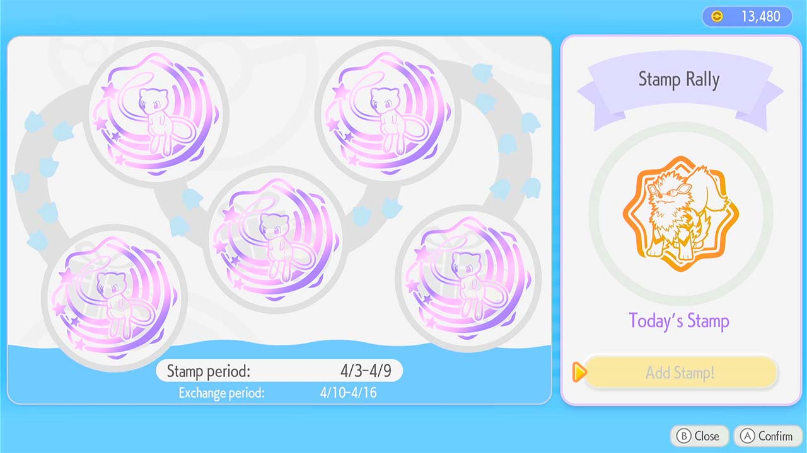

# Cloud Island Reset

<h2 style="color:red">THIS PROGRAM DELETES YOUR CLOUD ISLAND!!!</h2>

<h2 style="color:red">DO NOT USE IF YOU WANT TO KEEP YOUR CLOUD ISLAND</h2>

## Program Description

Delete and create the Cloud Island to collect Mew Stamps
    

## Instructions

**Switch Settings:**

1. Screen size: Must be 100% within the Switch settings
2. [Switch 2: All HDR options must be disabled.](../NintendoSwitch/Switch2Notes.md#switch-2-hdr-may-be-problematic)
3. [Switch 2: The profile you are using must be the 1st (left-most) profile.](../NintendoSwitch/Switch2Notes.md#resetting-a-game-moves-the-cursor-to-the-1st-user-profile)

**Program Settings:**

1. Video Resolution: 1080p or higher

### Instructions

1. Make sure you have a Cloud Island already created
2. Start the program in front of a PC that is not on your Cloud Island

## Options

### Number of Resets to Run:

The number of times to delete and create a Cloud Island.

The program will automatically stop early if all stamps are Mew.

### Go Home when Done:

Go to the Switch Home to idle when finished.

## Credits

- **Authors:** Gimikyu

**Discord Server:** 

