# Raspberry Pi: RP2040 and RP2350 family of boards (including Pico 1 and Pico 2)

This guide covers the entire RP2040 and RP2350 family of boards. This includes the Pico 1 and Pico 2.

However, if you have a Pico W or a Pico 2 W, [go this guide instead](Controller-PicoW-UART.md) which will include the wireless controllers.

There are 2 main setups of this family of boards:

| **Mode** | **Connections** | **Controller Support** | **Setup Difficulty** |
| --- | --- | --- | --- |
| **UART Mode (this guide)** | 1. USB port -> Switch 2. GPIO 4/5 or GPIO 0/1 -> External UART 3. External UART -> Computer | - HID: Keyboard - NS1: Wired Controller - NS2: Wired Controller - NS1: Wired Pro Controller - NS1: Wired Left Joycon - NS1: Wired Right Joycon | Difficult |
| [Advanced UART Mode](Controller-PicoW-Advanced.md) | 1. USB port -> Switch 2. GPIO 4/5 + VSYS -> External UART 3. External UART -> Computer | - HID: Keyboard - NS1: Wired Controller - NS2: Wired Controller - NS1: Wired Pro Controller - NS1: Wired Left Joycon - NS1: Wired Right Joycon | Most Difficult |

These are the harder setups that are the most similar to the older AVR8 setups (Arduino, Teensy, Pro Micro) where you must attach an external UART.

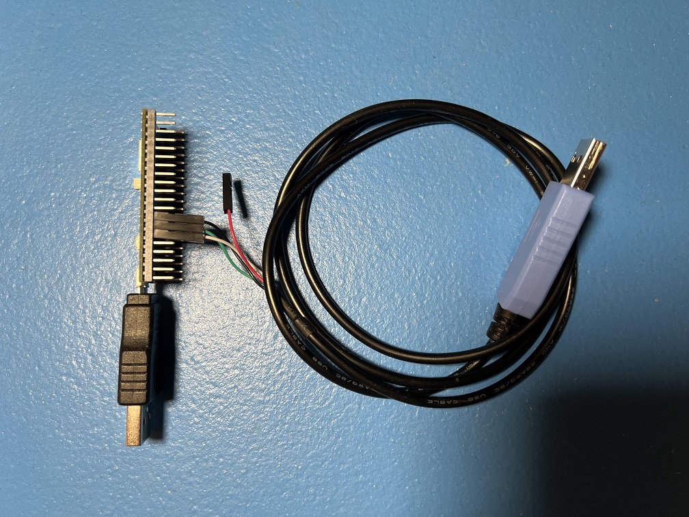 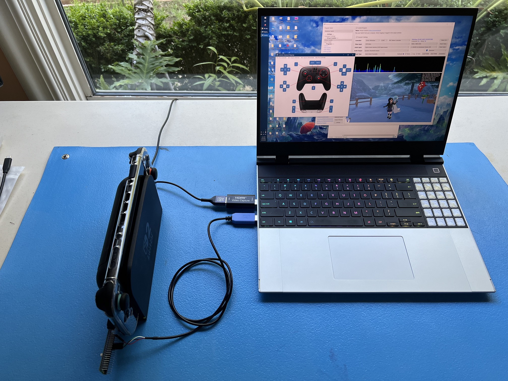

## Hardware Setup:

**Required Hardware (Full List):**

1. A regular [Nintendo Switch](../index.md#the-nintendo-switch) and its accessories (dock, power cable, HDMI cable). (You cannot use a Switch Lite.)
2. A [computer](../index.md#the-computer-the-player) running x64 Windows. (or another OS if you are able to set it up.)
3. A [video capture card](../index.md#video-capture-card-the-computers-eyes).
4. An RP2040 or RP2350 family microcontroller. (most models will work)
5. A micro-USB or USB-C to USB-A cable or adapter.
6. USB to Serial TTL (UART)

**Estimated Total Cost (USD):** (not including computer and Nintendo Switch)

- **Single Setup:** $29 - $40
    - Capture Card: $10 - $20
    - Microcontroller (with pins): $7 - $8
    - USB Cable/Adapter: $2
    - UART: $10
- **Bulk Purchase:** ~$20 per setup
    - Capture Card: $10
    - Microcontroller(with pins): $7 each from Micro Center
    - USB Cable/Adapter: < $1 each from AliExpress
    - UART: $2 each from Amazon

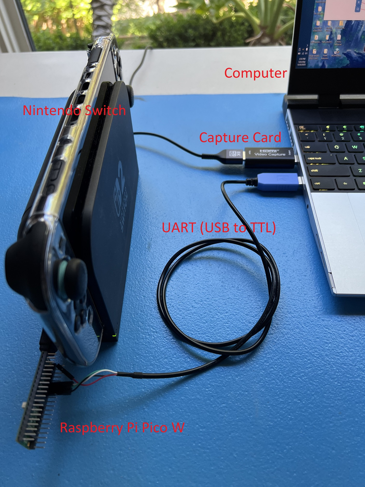

### Recommended Purchase Links:

**Capture Card:** [See previous section.](../index.md#video-capture-card-the-computers-eyes)

**Microcontroller:**

None. We don't actually recommend any of the RP2040/RP2350 boards other than the Pico W and Pico 2 W since they are difficult to setup. Therefore, this guide is for people who already have an RP2040/RP2350 board lying around and wish to use it for this project.

Example boards:

- Raspberry Pi Pico
- Raspberry Pi Pico 2
- SeeedStudio Xiao 2040
- SeeedStudio Xiao 2350
- Waveshare RP2040-Zero (untested)
- Waveshare RP2350-Zero (untested)

Note that Pico W and Pico 2 W will also work. But they have a [dedicated setup](Controller-PicoW-UART.md) for them that can utilize their wireless capability.

**A micro-USB or USB-C cable:**

Which one you need will depend on what your board has.

- Micro-USB -> USB-A Adapter: [https://www.amazon.com/gp/product/B09FXJD61Z](https://www.amazon.com/gp/product/B09FXJD61Z)
- Micro-USB -> USB-A Cable: [https://www.amazon.com/Android-Compatible-Smartphones-Charging-Stations/dp/B095JZSHXQ](https://www.amazon.com/Android-Compatible-Smartphones-Charging-Stations/dp/B095JZSHXQ)
- USB-C -> USB-A: [https://www.amazon.com/Charging-Durable-Station-Compatible-Samsung/dp/B08LL1SVZD](https://www.amazon.com/Charging-Durable-Station-Compatible-Samsung/dp/B08LL1SVZD)
- USB-C -> USB-C: [https://www.amazon.com/3-Pack-Charging-Braided-iPhone-Samsung/dp/B0D222QDF1](https://www.amazon.com/3-Pack-Charging-Braided-iPhone-Samsung/dp/B0D222QDF1)

**USB to Serial TTL (UART):**

There are many options here. The one we recommend (for ease of use) is the Adafruit model:

  - [https://www.adafruit.com/product/954](https://www.adafruit.com/product/954)
  - [https://www.digikey.com/en/products/detail/adafruit-industries-llc/954/7064488](https://www.digikey.com/en/products/detail/adafruit-industries-llc/954/7064488)
  - [https://www.amazon.com/dp/B00DJUHGHI/](https://www.amazon.com/dp/B00DJUHGHI/)

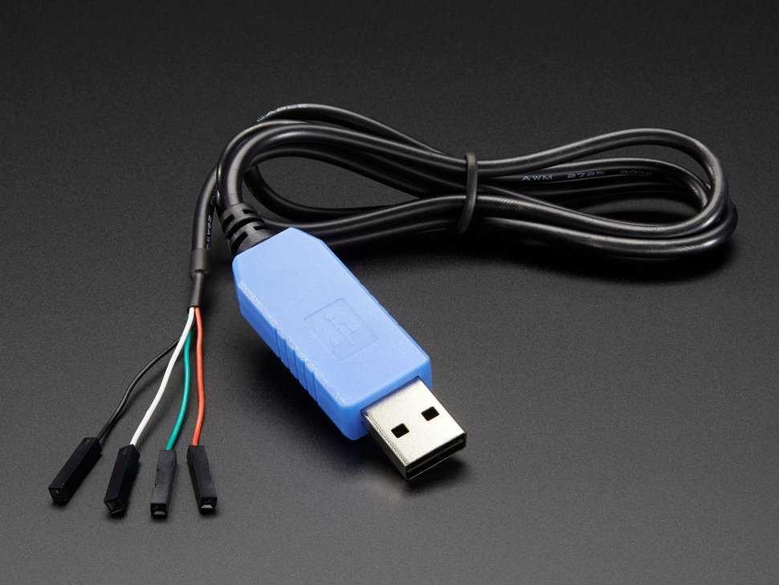

Or you can search for "CP2102" and you'll get tons of hits from various brands/sellers that look like these:

 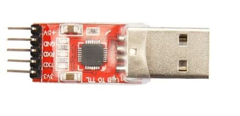

**Important:**

**DO NOT get cables with the Prolific controllers. e.g. PL2303 or any other model number.** They are cheap, do not work, and they are explicitly blocked in the program. **They often look deceptively similar to the Adafruit UART, but they are not the same.** If you buy outside of this link, verify it does not use PL controllers. If you buy it anyway, you will be wasting your time and money. **YOU HAVE BEEN WARNED!**

### Hardware Assembly:

Make the following connections:

There are two options here which allow you to choose which pins to use for the UART. The choice is determined by whether GPIO 26 and 27 are shorted out.

**Option 1:**

This is the default option.

| **UART pin** | **Adafruit UART Wire Color** | **RP2040/RP2350 Pin** |
| --- | --- | --- |
| RX | White | TX -> GPIO 4 |
| TX | Green | RX <- GPIO 5 |
| GND | Black | GND |
| VCC | Red | Leave unconnected |

**Option 2:**

Short out GPIO 26 and GPIO 27 to switch to this option. If your board has pins, this can be done with a jumper.

| **UART pin** | **Adafruit UART Wire Color** | **RP2040/RP2350 Pin** |
| --- | --- | --- |
| - | - | Connect GPIO 26 to GPIO 27. |
| RX | White | TX -> GPIO 0 |
| TX | Green | RX <- GPIO 1 |
| GND | Black | GND |
| VCC | Red | Leave unconnected |

This option is required for the SeeedStudio Xiao RP2040 board since it does not expose GPIO 5.

**Notes:**

- **If you did *NOT* buy the Adafruit UART, your wire colors will be different!** Refer to your UART's manual or board for the correct pins. Often, with CP210x modules, the pin type is written on the board itself. Also, note that the color of the jumper wires do not matter.
- It is important to leave VCC disconnected. VCC allows the UART to power the board, but the board is already being powered by the USB. Attempting to power the board from multiple sources without the appropriate backflow protection can damage your hardware!

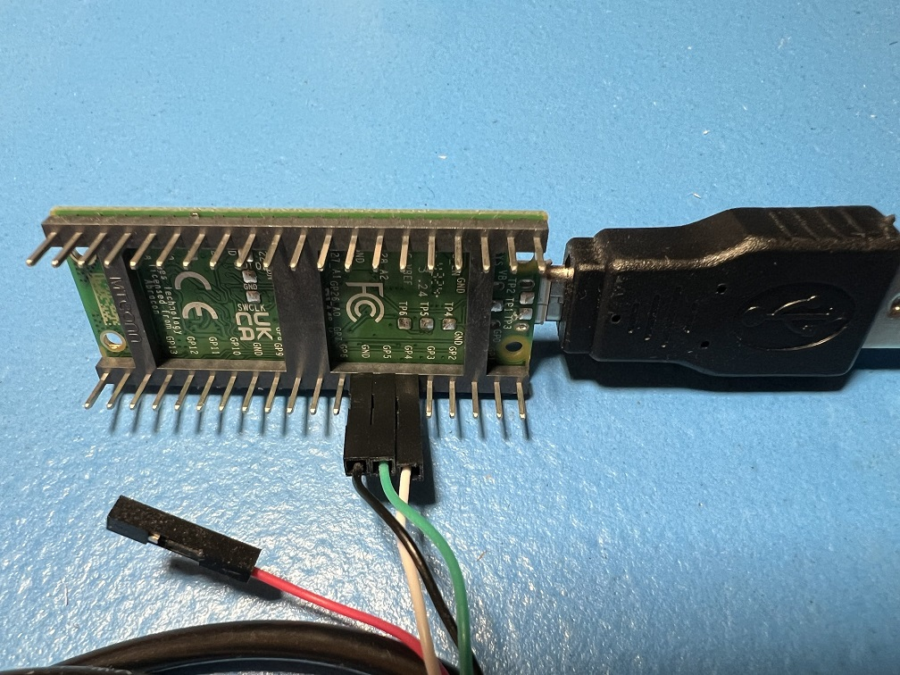

## Software Setup

### Step 0: Getting Ready

Make sure you have everything else setup so that it looks like this:

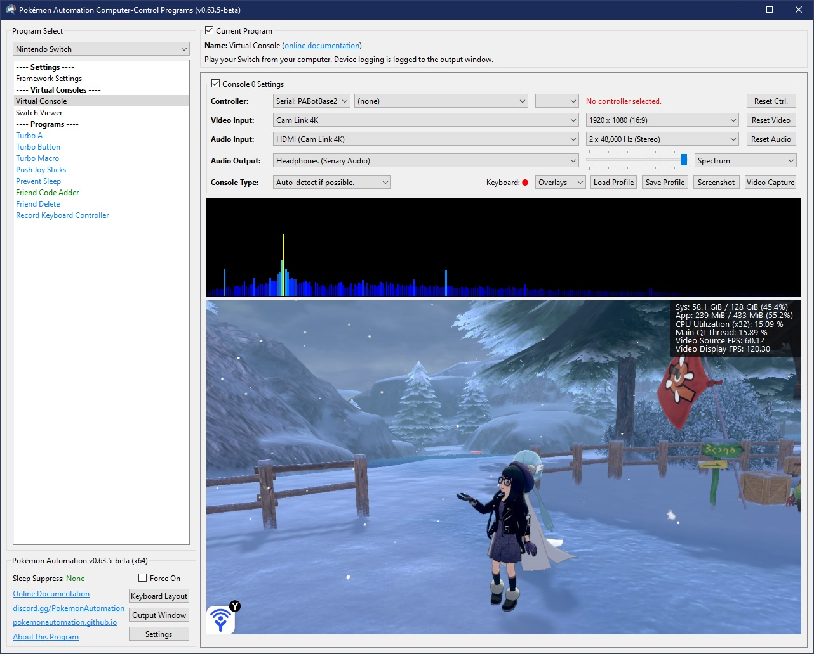

If not, you should go back to the [general setup guide](../index.md) and start over.

### Step 1: Enable "Pro Controller Wired Communication".

Go into your Switch settings and enable the following option. This step is required for wired Pro Controllers and Joycons.

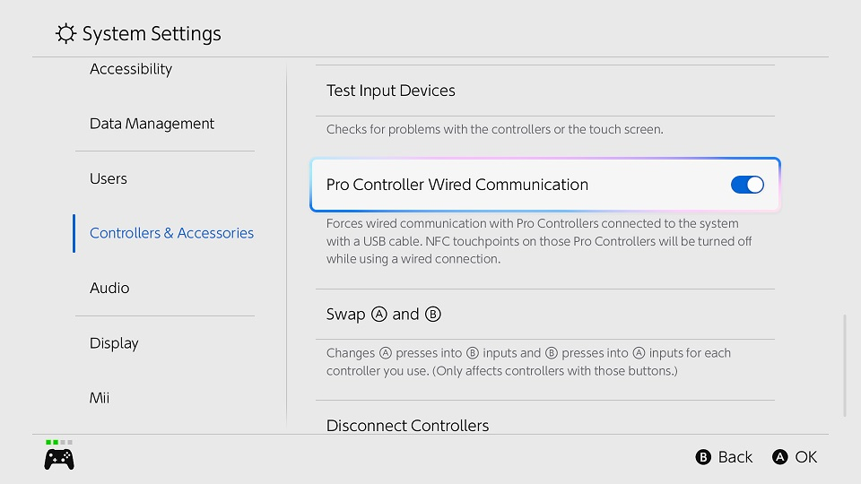

For those of you revisiting this page, you will notice that this step is new. This is because we have begun pushing everyone to use the Pro Controller since it has more features.

### Step 2: Flash the firmware to the board.

1. Unplug the board from everything. (both computer and dock)
2. Press and hold the white `Bootsel` button.
3. Plug the board's USB back into your computer while holding the `Bootsel` button. You can now release the button.
4. Go to "This PC" and look for a storage device:

     - On the RP2040 boards, it will be named `RPI-RP2`.
     - On the RP2350 boards, it will be named `RP2350`.

5. Open the `Firmware` folder and drag/drop one of the following files into that storage device. Once the copy is done, the device will disappear.

     - RP2040 boards: `PABotBase2-RP2040-<version>.uf2`
     - RP2350 boards: `PABotBase2-RP2350-<version>.uf2`

It's worth noting that the Pico1W and Pico2W firmware will also work here. However, those include the wireless connectivity and are much larger.
Unless your RP2040/RP2350 device has same CYW43439 wireless chip connected to the same GPIO pins as the Picos, the Pico firmware will not work for the wireless controllers.

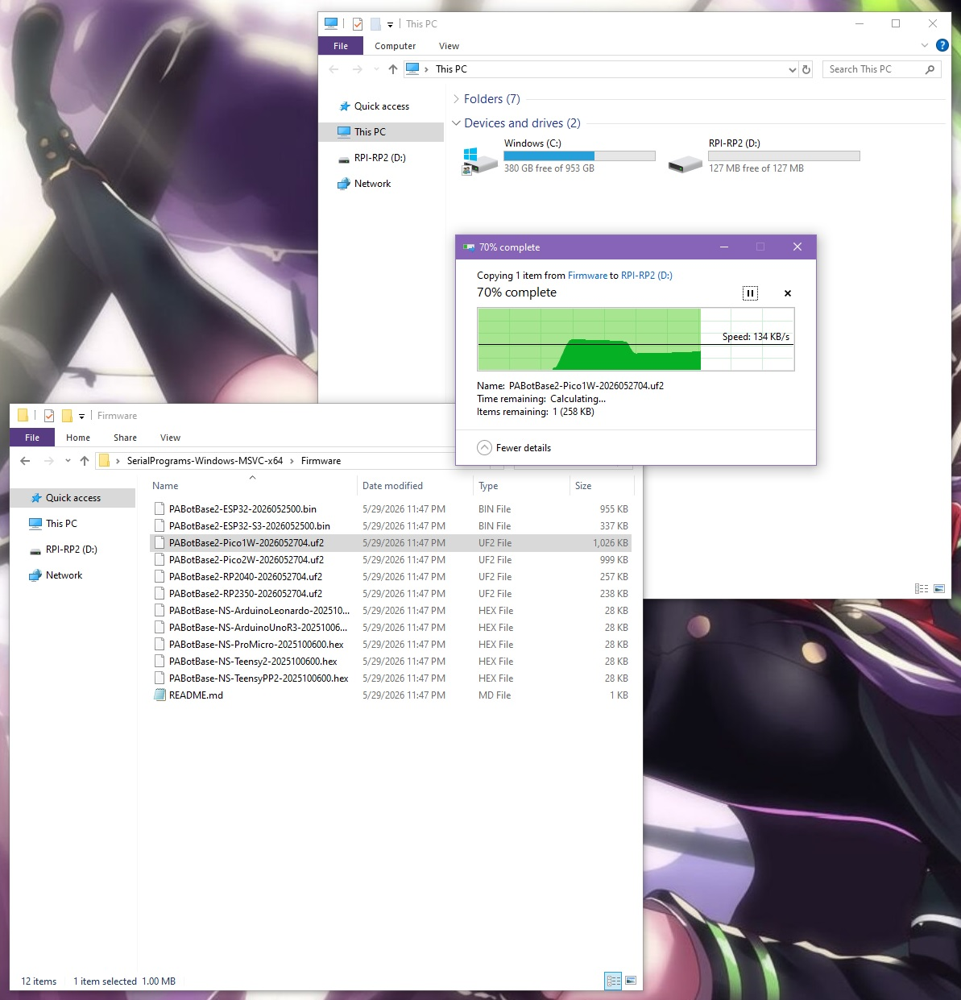

6. Unplug the board's USB from your computer. Then plug it into your Switch.
7. Plug the UART into your computer.

### Step 3: Install UART drivers

If your computer doesn't recognize the UART as a COM port (serial device), you may need to install the UART drivers. If you brought the Adafruit UART in this guide, the driver you will need is this:

- CP210x: [https://www.silabs.com/documents/public/software/CP210x_Windows_Drivers.zip](https://www.silabs.com/documents/public/software/CP210x_Windows_Drivers.zip)

Open up Device Manager and look for it under "Serial Ports". If you don't see it, then maybe these above drivers are not correct. Or try a different USB port.

### Step 4: Navigate to the Grip Menu

The grip menu is the only place where a wireless controller can pair with the Switch. Wired controllers have more flexibility. But for simplicity, we'll go to the grip menu regardless.

To get there from the Switch Home screen: `Controllers` (button next to the Settings gear) -> `Change Grip/Order`

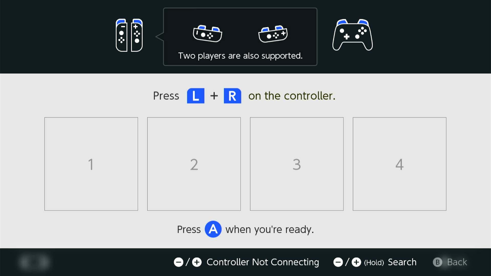

### Step 5: Connect the board to the Computer Control program

1. At the top for the "Controller" option, click the dropdown and select `Serial: PABotBase2` (Make sure you choose `Serial: PABotBase2` and not `Serial: PABotBase`!)
2. In the next dropdown, select your serial device. On Windows it will be something like `COM3`.

If you don't see the device in the dropdown, you probably need to refresh it (especially if you kept the program open since Step 0). You can refresh the list by clicking "Reset Ctrl".

If everything worked correctly, it will look like this:

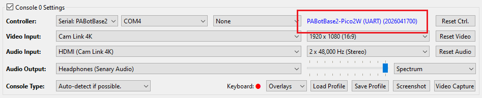

If you see it stuck on `Connecting...`, try swapping the TX and RX lines between the board and the UART. These are very commonly wrong!

### Step 6: Connect the board Switch.

1. In the 3rd dropdown, choose "NS1: Wired Pro Controller".
2. Click the video feed to activate the keyboard controls.
3. Press ENTER on your keyboard.

You should now see a controller show up on the Switch.

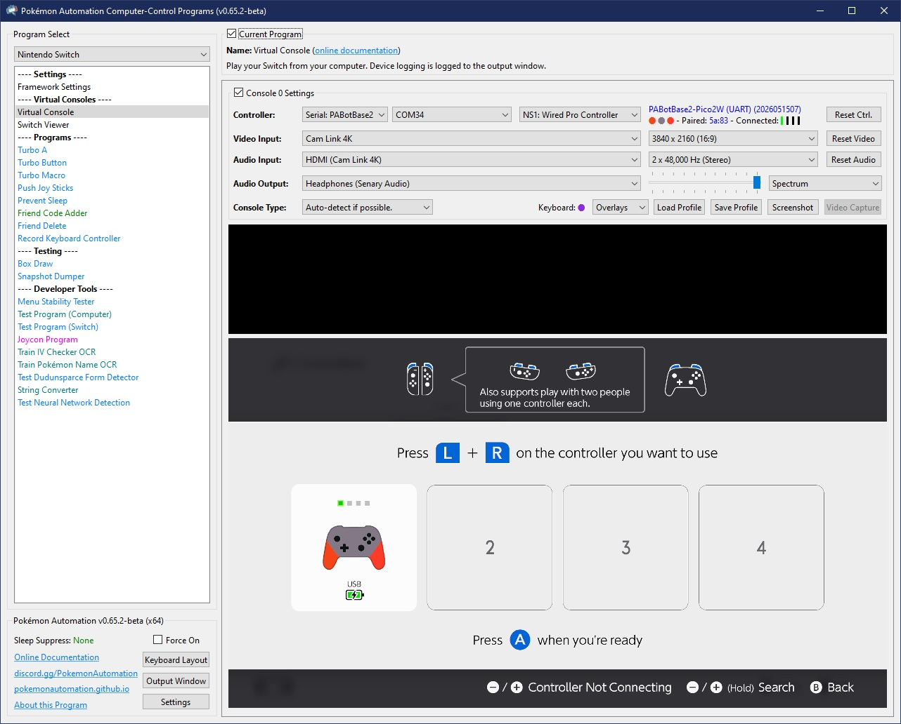

**Status Indicator:**

- The 3 colored dots should match the colors of the controller as shown in the Switch. This helps to distinguish controllers if you have multiple of them. You can change the colors in the `Nintendo Switch -> Framework Settings` menu.
- The four alpha-numeric characters after `Paired:` are the last 2 bytes of the MAC address of the Switch that the controller is paired with.
- The 4 vertical lines after `Connected:` are the player lights that are normally found on a real controller.

### Step 8: Test the connection

You can control your Switch from the keyboard. Click on the video display to activate the keyboard controls. Then try pressing some buttons. You can view the keyboard -> controller mapping by clicking on the "keyboard layout" at the bottom left corner of the program.

The default keyboard layout is the English QWERTY layout. If you have a different layout, you can change the mappings in `Nintendo Switch -> Framework Settings` and scroll down to the controller mapping tables.

We recommend familiarizing yourself with the keyboard controls as this is the preferred way to control your Switch while setting up to run a program. Each controller type has a different keyboard mapping. By default, the joystick (left joystick for Pro Controller) is mapped to the usual WASD setup that's used in FPS games. For joycons, there are two sets of mappings (using different keys) that will serve both vertical and sideways orientations.

Overall, the idea here is that you can play your Switch from your computer. While it's not as nice as using a native controller, it is good enough to easily setup programs - especially if you're doing this remotely where you do not have physical access to the Switch.

**Controller Types:**

You will notice that there are 7 controller options:

- None
- [HID: Keyboard](../ControllerGuide.md#hid-keyboard)
- [NS1: Wired Controller](../ControllerGuide.md#ns1-wired-controller)
- [NS2: Wired Controller](../ControllerGuide.md#ns2-wired-controller)
- [NS1: Wired Pro Controller](../ControllerGuide.md#ns1-wired-pro-controller)
- [NS1: Wired Left Joycon](../ControllerGuide.md#ns1-wired-leftright-joycon)
- [NS1: Wired Right Joycon](../ControllerGuide.md#ns1-wired-leftright-joycon)

Click on the link for detailed documentation for the controller type. "None" simply idles the board so it isn't trying to connect to a Switch. The others tell the board to act as that controller respectively. Setting to "None" is a convenient way to disconnect board Pico so you can connect your physical controller.

### Step 8: You are done!

If keyboard commands are working (along with video and audio), you are done!

Try clicking on other programs on the sidebar. You will find that all of them are "virtual consoles" that will accept keyboard commands. At the top of every program is a link to the wiki that explains how to setup and use that program.

Continue on to [Finishing Up](../index.md#step-4-finishing-up)!

## Alternative Setups:

This guide was written for the simplest possible setup. But if you're here, you probably already know what you're doing. So feel free to do your own setups.

Here are some alternate setups:

| **Picture** | **Description** |
| --- | --- |
| [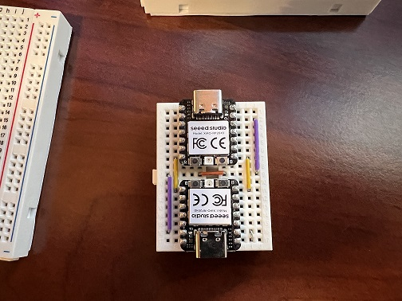](../Images/RP2040-Family/SeeedStudioXiao2040_small.jpg) | 2 x SeeedStudio Xiao RP2040  The top board acts as a USB/UART bridge running [this firmware](https://github.com/PokemonAutomation/debugprobe). The bottom board is the controller firmware running PABotBase.  Note the tiny jumper on the bottom right corner. This shorts out GPIO 26+27 to force PABotBase to use GPIO 0+1 as the UART pins. |
| [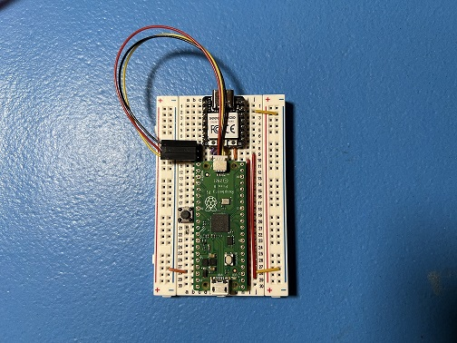](../Images/RP2040-Family/Xiao2040+Pico.jpg) | SeeedStudio Xiao RP2040 + Pico 1  The Xiao RP2040 acts as a USB/UART bridge running [this firmware](https://github.com/PokemonAutomation/debugprobe). The regular Pico on the bottom is running PABotBase.  This is actually a developer debugging setup where the Xiao is a fully functional [Debug Probe](https://www.raspberrypi.com/documentation/microcontrollers/debug-probe.html) where the UART is used for CC <-> PABotBase connectivity. |

## Troubleshooting:

### Docking and undocking the Switch resets or hangs the board

Main Article: [Power Glitching](../../PowerGlitching.md)

If you are experienced with circuits and would like to attempt a hardware fix, see [Pico W (Advanced)](Controller-PicoW-Advanced.md).

**Credits:**

- Kuroneko/Mysticial

**Discord Server:** 

