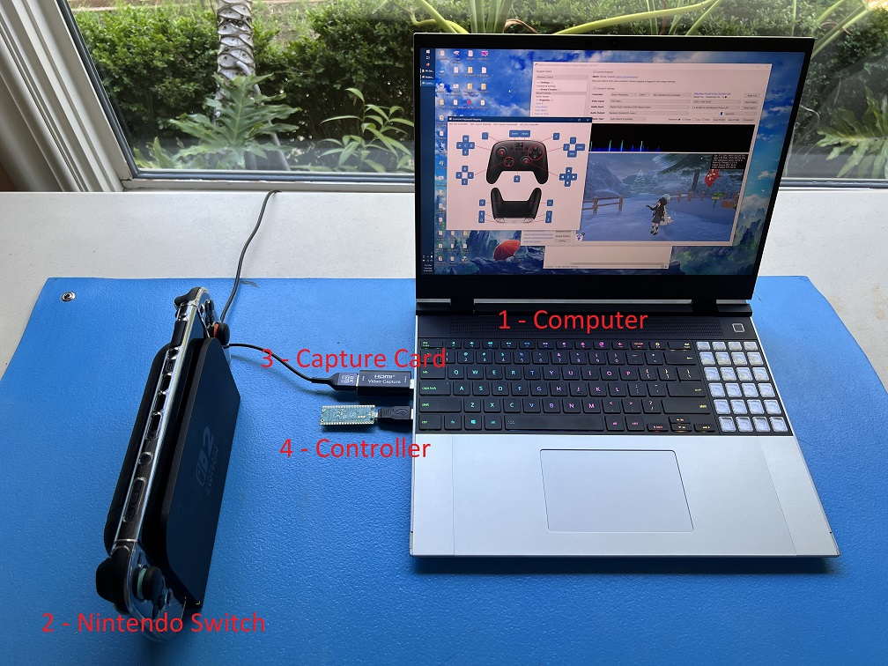
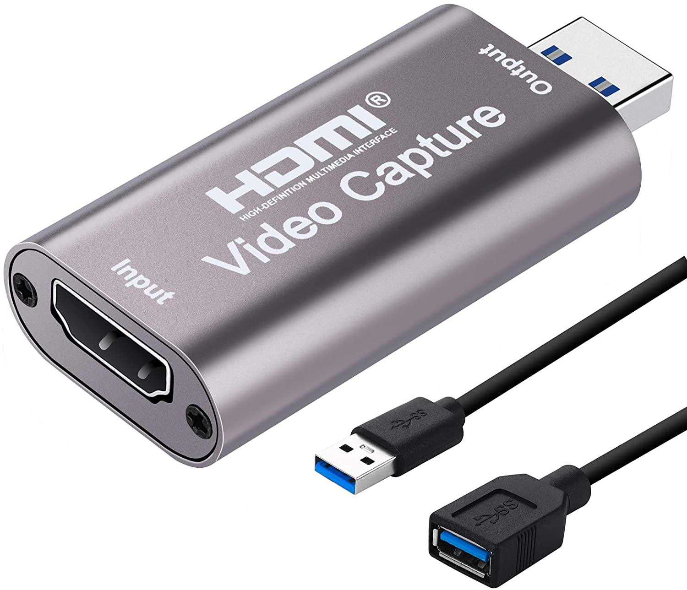
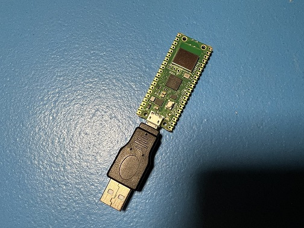
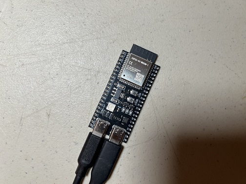
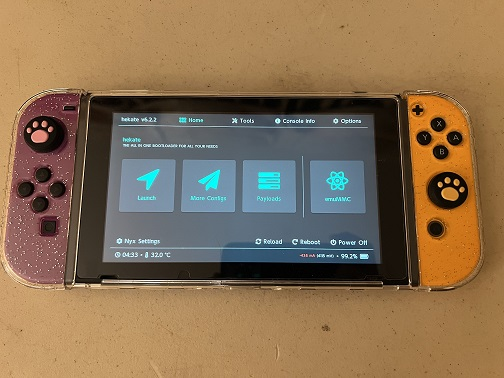
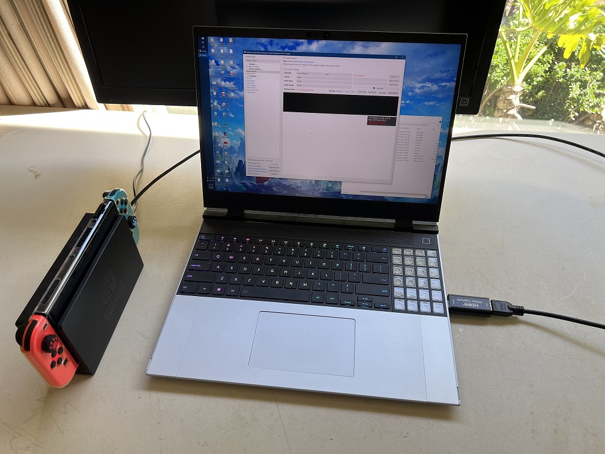
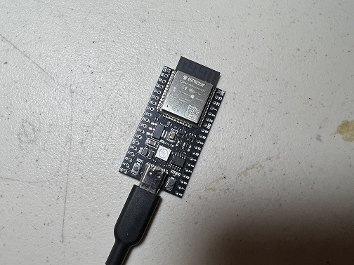
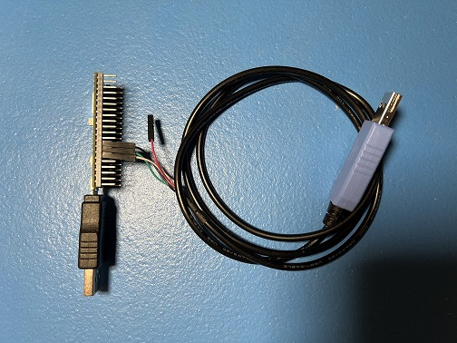
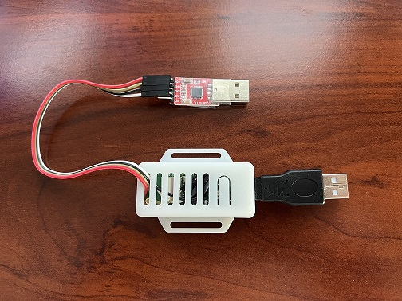
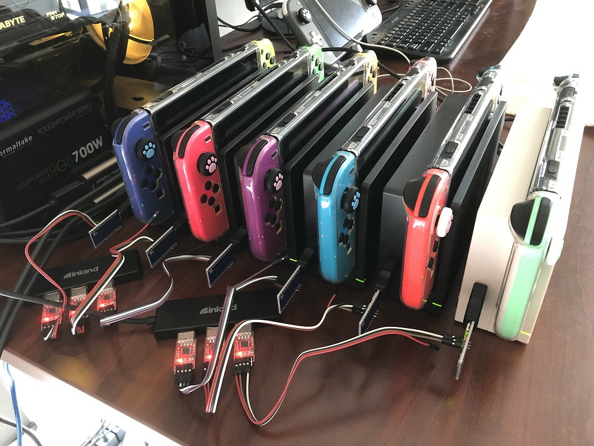

# Computer Control (CC) Setup Guide

**Jump To:**

 - [**Step 1:** The Hardware](#step-1-the-hardware)
 - [**Step 2:** General Setup (setting up everything except the controller)](#step-2-general-setup-setting-up-everything-except-the-controller)
 - [**Step 3:** Controller Setup](#step-3-controller-setup)
 - [**Step 4:** Finishing up](#step-4-finishing-up)

--------

**Video Tutorials:**

- [**Wired (ESP32-S3) Tutorial**](https://youtu.be/ezBuwk48z8w) (recommended for newcomers)
- **Wireless (Pico-WH) Tutorial** (recommended for newcomers) (video tutorial pending)
- [**Wireless (ESP32) Tutorial**](https://youtu.be/YzGyQQOGjl8)

--------

This is the setup guide for the computer control (CC) automation setup. We recommend that you read this before purchasing any hardware. Cost estimates will vary depending on the method you choose.

The computer control (CC) automation setup consists of 4 main components:

1. A computer.
2. A Nintendo Switch.
3. A video capture card.
4. A controller to control the Switch.

The computer is the player. The capture card is its eyes. The controller is its hands.

Here is an example of a full setup using a Raspberry Pi Pico W microcontroller:

## Step 1: The Hardware

### The Computer: (the player)

You need a full computer to run CC programs. A phone or tablet will not work.

**Windows:**

If you are running Windows, your computer must:

1. Be running 64-bit Windows 10 or later.
2. An x64 CPU. (An Intel or an AMD CPU. You cannot use a Qualcomm Snapdragon.)
3. Be sufficiently powerful.*

**We recommend a quad-core CPU of 3+ GHz, no older than 5 years from the date you are reading this. If you intend to control more than 1 switch, you will need a more powerful CPU with more cores. If you want to run 4 Switches all with feedback, we recommend a modern 8-core computer.**

**If you intend to buy a computer specifically for this, you will want to future proof yourself with a mid-high end computer no older than 2 years from the date you are reading this. Why is this a moving target? Video inference is constantly advancing especially as we begin to embrace AI and machine learning.**

You will also need 2 spare USB ports. (or 2 ports per Switch if you intend to run multiple Switches)

**macOS:**

For Macs, we support both x64 and M1 Macs. For x64 Mac, it will need to be one the last models or it's likely not powerful enough.

Our macOS support is missing a few features present on Windows. A distributable is available for Intel and M1 Macs on macOS Sequoia (15) or later. For macOS Sonoma (14) and earlier, you will need to follow an extra set of instructions to build CC from source code.

If you are an experienced developer with macOS, your help in making macOS feature-complete would be greatly appreciated!

**Linux:**

We don't officially support Linux. Though if you are a developer, you can build from source and try it anyway. There is one major video display problem that prevents Linux from being usable without significant workarounds for the video issue.

### The Nintendo Switch

If you're going to automate a Nintendo Switch game, then you need to have a Nintendo Switch.

| **Console** | **Supported?** |
| --- | --- |
| Nintendo Switch 1 | Yes |
| Nintendo Switch 2 | Yes |
| Nintendo Switch Lite | No |

We support both Switch 1 and Switch 2, but not the Switch Lite. The Switch Lite does not have HDMI video output for the computer to see your Switch. Unfortunately you cannot just point a camera at the Switch Lite's screen since that comes with too much loss of quality. (Even if this worked, it's bad idea anyway since 24/7 gameplay will burn out the screen.)

### Video Capture Card (the computer's eyes)

A video capture card will allow a computer to capture the HDMI video output from your Nintendo Switch (or any other game console).

Example Shopping Links:

- [https://www.amazon.com/dp/B088HBRM7T](https://www.amazon.com/dp/B088HBRM7T)
- [https://www.amazon.com/dp/B09FLN63B3](https://www.amazon.com/dp/B09FLN63B3)

Most cheap capture cards work. Higher end-capture cards may cause issues with color detection.
Ensure the capture card is capable of a video output resolution of 1080p at 30 frames per second (FPS). Though we recommend at least 1080p/60 FPS to minimize video tearing.

For Switch 2 owners, you do not need an (expensive) 4k capture card to run automation on the Switch 2. These cheap 1080p capture cards will work fine on the Switch 2. But if you don't mind the price, feel free to get a 4k capture card anyway for the better graphics quality. Automation will work on both 1080p and 4k.

### The Controller: (the computer's hands)

The controller is the most difficult part to setup because there is no off-the-shelf product that will do it for you.

While we support quite a few different setups, these are the 3 that we recommend to new users:

| **Wireless** | **Wired** | **Custom Firmware** |
| --- | --- | --- |
|  |  |  |
| **Supported Controller Types:** - NS1: Wireless Pro Controller - NS1: Wireless Left Joycon - NS1: Wireless Right Joycon     | **Supported Controller Types:** - HID: Keyboard - NS1: Wired Controller - NS2: Wired Controller - NS1: Wired Pro Controller - NS1: Wired Left Joycon - NS1: Wired Right Joycon | **Supported Controller Types:** - NS1: Wired Controller       |
| **Recommended Microcontrollers:** - Raspberry Pi Pico W - Raspberry Pi Pico 2 W - ESP32 | **Recommended Microcontrollers:** - ESP32-S3    | **Recommended Microcontrollers:** - None required.    |
| Cheapest. Easiest to setup. Harder to use after setup. | More Expensive. Harder to setup. Easiest to use after setup. | Requires a hacked Switch running custom firmware (CFW). |
| Works on Switch 2. | Works on Switch 2. | Does not work on Switch 2 due to lack of CFW. |
| Runs nearly all programs - including LGPE.* | Runs all programs - including LGPE.* | Cannot run LGPE.* Runs most other programs. |
| Slower and less reliable than wired. | Fastest and most reliable. | Identical to wired controllers. |
| Not recommended for remote access. Not recommended for high density setups due to wireless interference. | Very good for remote access. Very good for high density setups. | Not recommended for remote access. |
| Recommended for first time users due to ease of setup.| Recommended for heavy users who want to automate multiple Switches with maximum reliability. | Recommended for existing CFW users who want to try CC programs with minimal investment. |

For a complete list of setups - see our [Controller List](../ControllerList.md).

*Please consult the [program list](../Programs/index.md) for the full compatibility table.

### **Recommendations:**

These recommendations are not mutually exclusive. Feel free to get multiple setups!

| **User Type** | **Recommendation** | **Comments** |
| --- | --- | --- |
| You are completely new to automation. | Pico W {.nowrap} | Cheapest. Easiest to setup. |
| You are a heavy user of automation with multiple Switches running 24/7. | ESP32-S3 {.nowrap} | Most stable and reliable. No hassle after setup. |
| You are a frequent traveler. | Pico W or ESP32 {.nowrap} | Fewer cables = less hassle |
| You are an existing Computer Control user who already has the Arduino/Teensy setup. | ESP32-S3 {.nowrap} | Support for AVR8 controllers (Arduino/Teensy) has been discontinued. |
| You are coming from another automation project that uses ATmega MCUs. (Arduino, Teensy 2.0, Pro Micro) | ESP32-S3 {.nowrap} | Support for AVR8 controllers (Arduino/Teensy) has been discontinued. |
| You are an experienced CFW user. | sys-botbase 3 {.nowrap} | This setup is designed specifically for you at no additional cost (beyond a capture card)! |

A full comparison of prices and difficulty of setup can be found on the [Controller List](../ControllerList.md#setup-comparison-table).

## Step 2: General Setup: (setting up everything except the controller)

The setup is quite simple until you get to the controller. So we will cover everything before the controller here.

See: [General Setup for Windows](GeneralSetup.md)

See: [General Setup for macOS](GeneralSetupMac.md)

When you are done, you should have the CC window running and looking like this:

 

## Step 3: Controller Setup:

Here the guide will diverge depending on which controller type you have chosen. Pick the one you chose earlier.

| | **Device Type** | **Supported Controllers** | **Setup Difficulty (Scale 1-10)** | **Guides** |
| --- | --- | --- | --- | --- |
|  | Raspberry Pi Pico W Raspberry Pi Pico 2 W (USB Mode) {.nowrap} | NS1: Wireless Pro Controller NS1: Wireless Left Joycon NS1: Wireless Right Joycon {.nowrap} | 1 | [Guide](Controllers/Controller-PicoW-USB.md) {.nowrap} |
|  | ESP32 {.nowrap} | NS1: Wireless Pro Controller NS1: Wireless Left Joycon NS1: Wireless Right Joycon {.nowrap} | 3 | [Windows](Controllers/Controller-ESP32-WROOM.md) [Mac](Controllers/Controller-ESP32-WROOM-MacOS.md) [Video Tutorial](https://youtu.be/YzGyQQOGjl8) {.nowrap} |
|  | ESP32-S3 {.nowrap} | HID: Keyboard NS1: Wired Controller NS2: Wired Controller NS1: Wired Pro Controller NS1: Wired Left Joycon NS1: Wired Right Joycon {.nowrap} | 3 | [Windows](Controllers/Controller-ESP32-S3.md) [Video Tutorial](https://youtu.be/ezBuwk48z8w) {.nowrap} |
|  | CFW: sys-botbase 3 {.nowrap} | NS1: Wired Pro Controller {.nowrap} | 2 | [Guide](Controllers/Controller-sys-botbase.md) {.nowrap} |
|  | Raspberry Pi Pico W Raspberry Pi Pico 2 W (UART Mode) {.nowrap} | HID: Keyboard NS1: Wired Controller NS2: Wired Controller NS1: Wired Pro Controller NS1: Wired Left Joycon NS1: Wired Right Joycon NS1: Wireless Pro Controller NS1: Wireless Left Joycon NS1: Wireless Right Joycon {.nowrap} | 5 | [Guide](Controllers/Controller-PicoW-UART.md) {.nowrap} |
|  | Raspberry Pi Pico W Raspberry Pi Pico 2 W (Advanced UART Mode) {.nowrap} | HID: Keyboard NS1: Wired Controller NS2: Wired Controller NS1: Wired Pro Controller NS1: Wired Left Joycon NS1: Wired Right Joycon NS1: Wireless Pro Controller NS1: Wireless Left Joycon NS1: Wireless Right Joycon {.nowrap} | 10 | [Guide](Controllers/Controller-PicoW-Advanced.md) {.nowrap} |

The full list can be found in the [Controller List](../ControllerList.md).

## Step 4: Finishing Up

Now that you are done with your setup, go run some programs!

[Computer Control Program List](../Programs/index.md)

Here are some misc. tips/tricks, and other hidden features of the CC programs!

- **Disable Sticky Keys:** The SHIFT key is mapped to the B button. So if you press it 5 times in the row, you will get a notification about sticky keys. You should turn it off.
- **Per-Program Wiki:** The top of the window is a link to wiki for the currently selected program. It will contain instructions on how to use the program.
- **Full Screen:** Double click a video feed to pop it out into a separate window. Double click the popped-out window again to full screen. ESC will exit full screen.
- **Switching Controllers:** Games like Pokémon only allow one controller to be connected at a time. This means you cannot have both your microcontroller board and your real controller connected at the same time. To easily swap between the device and your real (physical) controller, you can change the controller type to "None". Note that this is only supported by the ESP32, ESP32-S3, and Pico W setups. The other setups only have one controller type which cannot be turned off.
- **Saving Settings:** Settings are automatically saved when you close a program.
- **Console Settings** (controller, video, audio) are saved on a per-program basis rather than globally. (This is due to the existence of multi-Switch programs where it makes less sense to save globally.) So every time you switch to different program, you may need to re-enter everything. Needless to say, this can be annoying and inconvenient. Use the "Save Profile" and "Load Profile" buttons to easily save and load console settings across programs.
- **Upgrading:** To upgrade to a new version of the CC programs, download and unzip the new version. Then copy and paste the folder `UserSettings/` into the same place of the new version. This will transfer over all of your settings and program stats.
- **Suppress Screensaver:** If you are using the CC program to play your Switch manually using an external controller, the screensaver will likely kick on or your monitors will turn off due to inactivity on the computer. At the bottom left corner is an option called "Sleep Suppress". Check the box to force your computer to keep the monitors on so this doesn't happen. Just remember to turn it off when you are done or your monitors will stay on forever!
- **Stereo Audio:** Most cheap capture cards output mono channel audio at 96 KHz. In reality, it is 48 KHz stereo. We split the channels out to give you the original high-quality stereo sound from your Switch!
- **Change Keyboard to Controller Mappings:** Under program select, select `Nintendo Switch`. Then `Framework Settings`. Then scroll down to `Keyboard to Controller Mappings`.

### You have now unleashed the power of automation. May you play more than 24 hours per day!

## Other notes

### Updating
To update the Computer Control program, simply download the latest program, as per the [General Setup](GeneralSetup.md) instructions. If you wish, you may copy over your old `UserSettings` folder and copy it into the new program folder. This will copy over your old stats and settings.

Firmware updates on the microcontroller are less frequent, but they do happen occasionally. You will need to re-flash your microcontroller as before. You only need to update the firmware if the program specifically tells you to. You will see red text: "Incompatible protocol. Device: ... Please flash your microcontroller (e.g. ESP32, Pico W) with the .bin/.uf2 that came with this version of the program.". See [here](Reflash.md) for links to the flashing section for each microcontroller setup.

**Discord Server:** 

